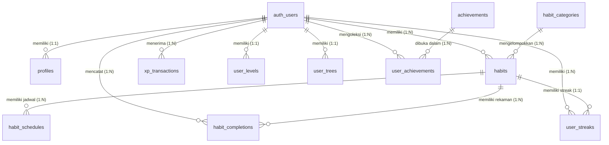
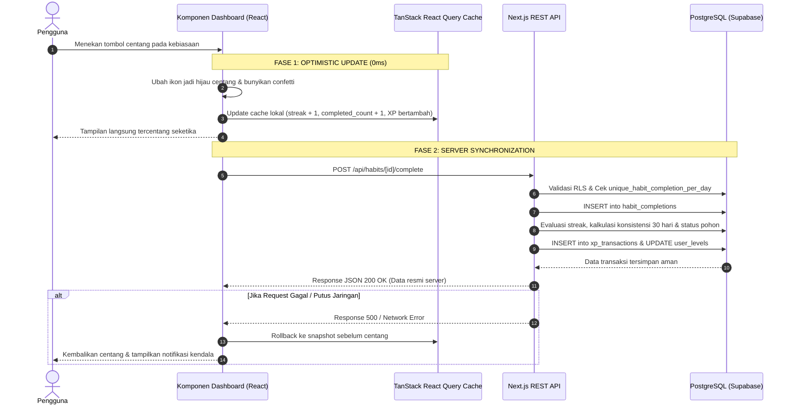
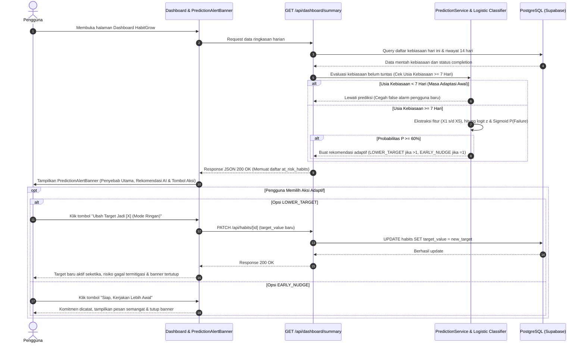
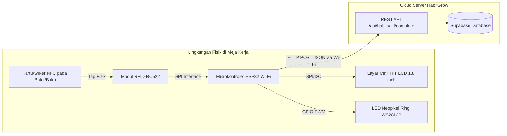

# 🌿 HabitGrow — Dokumen Arsitektur Proyek & Panduan Skripsi Lengkap

> **Versi Dokumen:** 1.2.0  
> **Terakhir Diperbarui:** 24 September 2026  
> **Target Pengguna:** Pengembang, Agen AI (*Context File*), dan Penulisan Laporan Tugas Akhir / Skripsi (Program Studi Sistem Komputer / Teknik Informatika / Sistem Informasi).

---

## 📑 DAFTAR ISI
1. [Ringkasan Eksekutif & Latar Belakang](#1-ringkasan-eksekutif--latar-belakang)
2. [Spesifikasi Kebutuhan Sistem (SRS)](#2-spesifikasi-kebutuhan-sistem-srs)
3. [Arsitektur Perangkat Lunak, Bahasa Pemrograman & Metodologi](#3-arsitektur-perangkat-lunak--teknologi)
   * 3.1 Rincian Tech Stack
   * 3.2 Bahasa Pemrograman yang Digunakan & Peran Spesifiknya
   * 3.3 Metodologi Rekayasa Perangkat Lunak (SDLC) & Riset Akademis
   * 3.4 Landasan Teori Ilmiah & Model Perilaku Pengguna (Behavioral Psychology)
   * 3.5 Arsitektur Distribusi & Generasi File Instalasi Mobile (Android APK)
4. [Perancangan Basis Data & Skema ERD](#4-perancangan-basis-data--skema-erd)
5. [Formulasi Algoritma & Logika Matematika Inti](#5-formulasi-algoritma--logika-matematika)
   * 5.1 Logika Non-Zero Day Global Daily Streak
   * 5.2 Logika Deteksi & Pemulihan Streak Putus (*Broken Streak*)
   * 5.3 Logika Skor Konsistensi Bergulir 30 Hari (*Rolling Consistency*)
   * 5.4 Logika Siklus Hidup Pohon Virtual (*Tree Growth & Lifecycle*)
   * 5.5 Logika Perhitungan XP & Progresi Level
   * 5.6 Logika Mutasi Antarmuka Instan (*Optimistic UI State & Rollback*)
   * 5.7 Logika Machine Learning: Prediksi Risiko Kegagalan (*Habit Churn*)
6. [Katalog Endpoint RESTful API](#6-katalog-endpoint-restful-api)
7. [Alur Bisnis End-to-End (User Journey & State Machine)](#7-alur-bisnis-end-to-end-user-journey--state-machine)
   * 7.1 Alur Eksekusi Checklist Taktil (Optimistic UI & Server Sync)
   * 7.2 Alur Sistem Prediksi Dini Machine Learning & Nudge Adaptif
8. [Struktur Direktori & Pemetaan Kode Sumber](#8-struktur-direktori--pemetaan-kode-sumber)
   * 8.1 Identitas Visual, Filosofi Logo & Lokasi Aset Gambar
9. [Cetak Biru Integrasi IoT untuk Skripsi Sistem Komputer](#9-cetak-biru-integrasi-iot-untuk-skripsi-sistem-komputer)
10. [Panduan Penulisan Proposal & Bab Skripsi (Bab 1 s/d Bab 5)](#10-panduan-penulisan-proposal--bab-skripsi)

---

## 1. RINGKASAN EKSEKUTIF & LATAR BELAKANG

### 1.1 Identitas Aplikasi
* **Nama Proyek:** HabitGrow
* **Tagline:** *Gamified Habit Tracker & Virtual Tree Progression System*
* **Platform:** Web Responsive (PWA-ready) & IoT Extensible
* **Paradigma Inti:** *Non-Zero Day Principle*, *Visual Empathy*, *Botanical Metaphor Gamification*, *Machine Learning Early Warning*.

### 1.2 Masalah yang Diselesaikan (*Problem Statement*)
Aplikasi pelacak kebiasaan konvensional sering kali gagal mempertahankan retensi pengguna dalam jangka panjang karena:
1. **Efek *Streak Fatigue* & Keputusasaan:** Pada aplikasi biasa, ketika pengguna gagal melakukan kebiasaan selama satu hari saja, *streak* gabungan langsung di-reset ke nol. Hal ini memicu efek psikologis *“what-the-hell effect”*, di mana pengguna merasa semua usahanya sia-sia dan akhirnya meninggalkan aplikasi.
2. **Visualisasi yang Kering dan Monoton:** Hanya berupa daftar checklist teks tanpa representasi visual organik yang mencerminkan pertumbuhan diri.
3. **Latensi Checklist yang Mengganggu:** Ketergantungan pada panggilan jaringan asinkron lambat membuat antarmuka terasa kaku saat mencentang kebiasaan.
4. **Ketiadaan Hubungan dengan Dunia Nyata:** Pelacak digital terisolasi di dalam layar gawai tanpa kehadiran fisik di meja kerja pengguna.
5. **Ketiadaan Sistem Pencegahan Dini Bersifat Prediktif (*Lack of Proactive Early Warning*):** Aplikasi umum bersifat pasif; hanya mencatat kegagalan setelah hari berganti, tanpa memberikan peringatan dini atau rekomendasi adaptif saat pengguna sedang berisiko tinggi melewatkan tugas hari itu.

### 1.3 Solusi HabitGrow
HabitGrow mengatasi masalah tersebut melalui:
* **Algoritma *Non-Zero Day Global Streak*:** Pengguna cukup menyelesaikan minimal 1 kebiasaan apa pun setiap hari agar api *streak* utama tidak padam.
* **Sistem Metafora Pohon Virtual (*Botanical Progression*):** Rutinitas pengguna secara langsung memberi nutrisi pada pohon virtual interaktif yang berevolusi melalui 5 tahap kehidupan (*Seed* $\rightarrow$ *Sprout* $\rightarrow$ *Young Tree* $\rightarrow$ *Healthy Tree* $\rightarrow$ *Mature Tree*).
* **Desain UI Berorientasi Manusia (*Human-Crafted Editorial*):** Menolak tata letak generik buatan AI; mengedepankan sapaan hangat personal, palet warna alam organik, kartu taktil dengan respons 0ms (*Optimistic UI*), dan konfeti perayaan instan.
* **Sistem Peringatan Dini Prediktif (*Machine Learning Habit Churn Early Warning*):** Memprediksi kebiasaan yang berisiko terlewat hari ini menggunakan klasifikasi *Binary Logistic Regression* 5 fitur ($P \ge 60\%$), serta menyajikan aksi adaptif (*Smart Nudge*) 1-klik untuk menurunkan target sementara.
* **Kesiapan Arsitektur IoT (Khusus Skripsi Sistem Komputer):** Backend berbasis REST API murni yang siap menerima pemicu fisik dari mikrokontroler (ESP32/RFID/NFC) maupun perangkat display meja mini.

---

## 2. SPESIFIKASI KEBUTUHAN SISTEM (SRS)

### 2.1 Kebutuhan Fungsional (Functional Requirements)
* **[FR-01] Autentikasi & Profil:** Pengguna dapat mendaftar, masuk, keluar, serta memperbarui nama tampilan dan preferensi zona waktu secara aman.
* **[FR-02] Manajemen Kebiasaan (CRUD):** Pengguna dapat membuat, melihat, memperbarui, mengarsipkan, dan menghapus kebiasaan dengan kustomisasi ikon, warna hex, tingkat kesulitan (*Easy/Medium/Hard*), target kuantitatif, dan satuan.
* **[FR-03] Penjadwalan Fleksibel:** Sistem mendukung tiga modalitas frekuensi: Harian (*DAILY*), Hari Tertentu (*SELECTED_DAYS*), dan Target Mingguan (*WEEKLY_TARGET*).
* **[FR-04] Eksekusi & Checklist Instan:** Pengguna dapat mencentang kebiasaan harian dengan umpan balik visual instan (0 milidetik) melalui mekanisme *Optimistic UI Update*.
* **[FR-05] Mesin Gamifikasi XP & Level:** Setiap penyelesaian kebiasaan menghasilkan *Experience Points* (XP) berdasarkan tingkat kesulitan yang berkontribusi pada kenaikan level pengguna secara terstruktur.
* **[FR-06] Pelacak Multi-Streak (Global & Individual):** Sistem memelihara *streak* spesifik untuk masing-masing kebiasaan sekaligus menghitung *Global Daily Streak* berbasis prinsip *Non-Zero Day*.
* **[FR-07] Deteksi & Peringatan Streak Putus (*Broken Streak Alert*):** Sistem secara otomatis mendeteksi jika sebuah kebiasaan mengalami putus *streak* pada hari kemarin dan menampilkan banner pemberitahuan yang empatik.
* **[FR-08] Ekosistem Pohon Virtual:** Pertumbuhan dan kesehatan pohon ditentukan oleh skor konsistensi bergulir 30 hari (*Rolling 30-Day Consistency Score*).
* **[FR-09] Sistem Pencapaian (*Achievements*):** Membuka lencana dan trofi khusus ketika pengguna mencapai tonggak sejarah tertentu (misal: *First Step*, *Streak 7 Days*, *Mature Tree*).
* **[FR-10] Analitik & Riwayat:** Menyajikan rekapitulasi data visual, kalender aktivitas, dan distribusi kebiasaan.
* **[FR-11] Filter Dashboard Dinamis:** Memfasilitasi penyaringan daftar tugas hari ini (*Semua*, *Belum Selesai*, *Selesai*).
* **[FR-12] Dukungan Tema Ganda:** Antarmuka responsif dengan transisi mulus antara Mode Gelap (*Dark Mode*) dan Mode Terang (*Light Mode*).
* **[FR-13] Sistem Prediksi Risiko Kegagalan (Machine Learning Early Warning):** Sistem secara proaktif mengevaluasi riwayat 14 hari pengguna dengan model *Binary Logistic Regression*, menghitung probabilitas kegagalan ($P \ge 60\%$), dan menyajikan rekomendasi adaptif (*Smart Predictive Nudge*) dengan opsi penyesuaian target kuantitas 1-klik (`PATCH /api/habits/[id]`).

### 2.2 Kebutuhan Non-Fungsional (Non-Functional Requirements)
* **[NFR-01] Latensi Umpan Balik Antarmuka:** Perubahan status visual checklist harus $\le 50\text{ ms}$ di sisi klien tanpa menunggu *round-trip* server selesai.
* **[NFR-02] Integritas Data & Keamanan (RLS):** Seluruh baris data pada PostgreSQL dilindungi oleh *Row Level Security* (RLS) di mana pengguna hanya dapat membaca dan memodifikasi datanya sendiri.
* **[NFR-03] Kepatuhan Standar RESTful:** Seluruh komunikasi klien-server menggunakan protokol HTTP dengan kata kerja standar (`GET`, `POST`, `PATCH`, `DELETE`) dan payload berformat JSON.
* **[NFR-04] Ketersediaan API untuk Eksternal:** API dirancang *stateless* sehingga dapat diakses oleh mikrokontroler IoT dengan autentikasi berbasis Bearer Token / Supabase JWT.
* **[NFR-05] Keandalan Pengujian (*Test Coverage*):** Seluruh modul algoritma matematika inti wajib memiliki *unit tests* terotomatisasi dengan tingkat keberhasilan 100%.
* **[NFR-06] Efisiensi Inferensi Model ML (Serverless Execution Latency):** Waktu komputasi ekstraksi 5 fitur dan inferensi probabilitas fungsi sigmoid pada serverless runtime harus $\le 10\text{ ms}$ per evaluasi tanpa memerlukan GPU atau microservice Python terpisah.

---

## 3. ARSITEKTUR PERANGKAT LUNAK & TEKNOLOGI

Aplikasi HabitGrow mengadopsi arsitektur modern **Fullstack Jamstack / Micro-Services Ready** dengan pemisahan tegas antara lapisan presentasi, logika bisnis, dan basis data:

```mermaid
graph TD
    subgraph Klien / Frontend (Next.js 16 + React 19)
        UI[Halaman & Komponen UI]
        RQ[TanStack React Query - Cache & Optimistic UI]
        UI -->|Aksi Centang 0ms| RQ
    end

    subgraph Perangkat Eksternal (IoT)
        ESP32[Mikrokontroler ESP32 / RFID Sensor]
    end

    subgraph Lapisan Server / API Routes
        API[Next.js Route Handlers / REST API]
        VAL[Zod Schema Validators]
        SVC[Domain Service Layer]
        ALG[Pure Mathematical Algorithms]
        API --> VAL --> SVC --> ALG
    end

    subgraph Lapisan Basis Data (Supabase Cloud)
        AUTH[Supabase Auth - JWT]
        PG[(PostgreSQL 15)]
        RLS[Row Level Security Engine]
        PG --- RLS
    end

    RQ -->|HTTP REST JSON| API
    ESP32 -->|HTTP POST /api/habits/:id/complete| API
    SVC -->|Supabase SDK / SQL| PG
```

### 3.1 Rincian Tech Stack
* **Framework Frontend:** Next.js 16.3.5 (App Router, Turbopack Engine).
* **Library Antarmuka:** React 19, Lucide React (ikonografi modern), Canvas Confetti (efek selebrasi).
* **Manajemen State & Cache Server:** TanStack React Query v5 (Optimistic Mutations, Automatic Invalidation, Cache Rollback).
* **Styling & Desain:** Tailwind CSS v4, CSS Variables, Nature-inspired HSL color tokens.
* **Backend Runtime:** Node.js 20+ / Next.js Serverless Edge & Node runtime.
* **Mesin Machine Learning:** In-Browser / Serverless Edge Binary Logistic Regression Classifier (Sigmoid Evaluation, 5 Feature Vectors, waktu inferensi $< 5\text{ ms}$ tanpa GPU eksternal).
* **Validasi Skema:** Zod v3 (validasi *runtime payload* ketat di sisi klien dan server).
* **Basis Data:** PostgreSQL via Supabase (Auth, Foreign Keys, UUID v4, Triggers, RLS).
* **Unit Testing:** Vitest v5 (menjamin kebenaran algoritma secara deterministik).

---

### 3.2 Bahasa Pemrograman yang Digunakan & Peran Spesifiknya

Untuk keperluan penulisan Bab 3 Skripsi dan pemahaman mendalam AI, berikut adalah taksonomi bahasa pemrograman yang digunakan pada proyek HabitGrow:

| No | Bahasa Pemrograman | Lingkungan / Lapisan | Peran & Tanggung Jawab dalam Sistem |
| :---: | :--- | :--- | :--- |
| 1 | **TypeScript (v5.x)** | Fullstack (Frontend & Backend Route Handlers) | Merupakan bahasa pemrograman utama pada seluruh aplikasi. Menggunakan sistem pengetikan statis (*static typing*), *interface*, dan *generics* untuk mencegah galat *runtime* (*null/undefined pointer*), mempercepat *refactoring*, serta memastikan konsistensi kontrak data antara klien dan server. |
| 2 | **SQL (PostgreSQL 15 Dialect)** | Basis Data (Supabase Cloud) | Digunakan untuk mendefinisikan skema tabel (*DDL*), relasi kunci asing, *unique constraints*, fungsi pemicu (*triggers*), indeks kinerja (B-Tree), dan kebijakan keamanan baris data (*Row Level Security / RLS*). |
| 3 | **CSS3 (Tailwind CSS v4 Engine)** | Frontend Presentation Layer | Mengatur seluruh tata letak visual, responsivitas multi-layar, variabel warna dinamis (HSL), efek kaca (*glassmorphism*), serta transisi *micro-animation* tema terang/gelap. |
| 4 | **HTML5 (Semantic JSX)** | Frontend Structure | Struktur dokumen web berbasis tag semantik (`<header>`, `<main>`, `<section>`, `<article>`), atribut aksesibilitas (*ARIA labels*), dan kepatuhan standar WCAG. |
| 5 | **C / C++ (Arduino Framework)** *(Sub-sistem IoT)* | Firmware Mikrokontroler (ESP32) | Digunakan pada skenario skripsi Sistem Komputer untuk memprogram mikrokontroler ESP32: menginisialisasi modul sensor RFID-RC522 via antarmuka SPI, membaca kartu NFC, mengendalikan layar TFT, serta mengirimkan paket HTTP POST JSON ke server via Wi-Fi. |

---

### 3.3 Metodologi Rekayasa Perangkat Lunak (SDLC) & Riset Akademis

Dalam penyusunan skripsi, proyek ini mengadopsi metodologi pengembangan formal berikut:

#### 1. Model Pengembangan Sistem: *Agile Development with Prototyping*
* **Fase 1: Analisis Kebutuhan (*Requirements Engineering*):** Identifikasi masalah psikologis *streak fatigue*, perumusan Kebutuhan Fungsional (FR) dan Non-Fungsional (NFR).
* **Fase 2: Perancangan Arsitektur (*System Architecture & Database Design*):** Perancangan ERD relasional 13 tabel, pemodelan diagram sekuens, dan spesifikasi REST API.
* **Fase 3: Implementasi Bertahap (*Incremental Sprints*):**
  * *Sprint 1:* Autentikasi dan fondasi CRUD kebiasaan.
  * *Sprint 2:* Implementasi algoritma matematika (*Streak*, *Consistency*, *Level*, *Tree*).
  * *Sprint 3:* Optimasi antarmuka taktil (0ms *Optimistic UI Update*) dan selebrasi visual.
  * *Sprint 4:* Integrasi modul deteksi streak putus dan filter kebiasaan harian.
* **Fase 4: Pengujian & Evaluasi (*Verification & Validation*):** Pengujian unit terotomatisasi (*Unit Testing*) dan pengujian fungsi kotak hitam (*Black-box Testing*).

#### 2. Metodologi Pengujian (*Testing Methodology*):
* **Unit Testing Terotomatisasi (Vitest):** Pengujian unit berbasis pendekatan *Test-Driven Development (TDD)* pada modul algoritma matematika (`src/lib/algorithms/__tests__/`). Menjalankan **31 skenario uji deterministik** (12 uji streak, 6 uji pohon, 5 uji level, 4 uji XP, 4 uji konsistensi) dengan tingkat kelulusan 100%.
* **Blackbox Functional Testing:** Pengujian seluruh rute antarmuka pengguna, validasi form Zod, transisi tema terang/gelap, dan penanganan galat HTTP (400, 401, 500).
* **Network & Latency Testing:** Mengukur perbedaan waktu persepsi pengguna antara rendering optimistik lokal ($\le 10\text{ ms}$) dibandingkan respons jaringan Supabase (rata-rata $150 - 400\text{ ms}$).

---

### 3.4 Landasan Teori Ilmiah & Model Perilaku Pengguna (Behavioral Psychology)

HabitGrow bukan sekadar aplikasi pencatat, melainkan implementasi sistem dari teori-teori psikologi perilaku pembentukan kebiasaan:

1. **Teori *The Habit Loop* (Charles Duhigg & James Clear - *Atomic Habits*):**
   * **Cue (Pemicu):** Tampilan tanggal personal, status kebun harian, serta pemicu fisik meja (*NFC desk tag*).
   * **Routine (Rutinitas):** Pelaksanaan kebiasaan positif yang dicatat melalui checklist taktil.
   * **Reward (Hadiah Instan):** Perolehan XP, animasi konfeti mekar, pembaruan level, dan kesegaran visual pohon virtual.
2. **Prinsip Psikologis *Non-Zero Day*:**
   * Menghilangkan rasa bersalah dan keputusasaan (*the what-the-hell effect*). Filosofi bahwa melakukan 1 kemajuan kecil jauh lebih bermakna daripada tidak sama sekali (0%). Hal ini diterjemahkan ke dalam algoritma *Global Daily Streak*.
3. **Teori Determinasi Diri (*Self-Determination Theory / SDT*) & Kerangka Gamifikasi Octalysis (Yu-kai Chou):**
   * *Development & Accomplishment:* Sistem Level bertingkat dan lencana pencapaian (*Achievements*).
   * *Ownership & Possession:* Pohon virtual yang bertumbuh seiring kedisiplinan diri.
   * *Empowerment of Creativity:* Kebebasan memilih warna, ikon, target kuantitas, dan frekuensi jadwal kebiasaan.

---

### 3.5 Arsitektur Distribusi & Generasi File Instalasi Mobile (Android APK)

Dalam konteks penyelesaian Tugas Akhir / Skripsi yang membutuhkan pengujian langsung pada gawai *smartphone* Android pengguna atau dosen penguji, sistem HabitGrow dirancang untuk dapat diekstrak menjadi **file paket instalasi fisik (`.apk`)**.

#### 1. Tiga Modalitas Pembangkitan File Instalasi Android (`.apk`):
* **Modalitas A: PWABuilder / Trusted Web Activity (TWA) — Instan & Efisien:**
  * Memanfaatkan *Progressive Web App manifest* dan integrasi Chrome Custom Tabs / TWA resmi dari Google.
  * Platform [PWABuilder](https://www.pwabuilder.com) membungkus URL hosting produksi (`https://habit-grow.vercel.app`) menjadi file `HabitGrow.apk` dalam hitungan 5 menit tanpa perlu mengunduh SDK Android Studio berukuran puluhan gigabyte di laptop pengembang.
* **Modalitas B: Capacitor Native Bridge (`@capacitor/android`) — Standar Industri Hybrid:**
  * Mengintegrasikan `@capacitor/core` dan `@capacitor/android` langsung ke repositori Next.js.
  * Mengonfigurasi `capacitor.config.json` dengan parameter `server.url` yang mengarah ke Vercel.
  * Menghasilkan proyek Android Studio native lengkap dengan struktur Gradle, di mana perintah `./gradlew assembleDebug` langsung memproduksi berkas fisik:
    `android/app/build/outputs/apk/debug/app-debug.apk`.
* **Modalitas C: Expo / React Native EAS Cloud Build — Full Native Frontend:**
  * Membangun frontend khusus seluler terpisah yang mengonsumsi Supabase Database dan REST API HabitGrow.
  * Menggunakan kompilasi cloud Expo (`eas build -p android --profile preview`) yang secara otomatis menghasilkan link unduhan file `.apk` mandiri.

#### 2. Justifikasi Akademis: Kebijakan Google Play Store vs. Standar Pengujian Skripsi:
* **Fakta Regulasi Akademis:** Standar kelulusan dan sidang skripsi di perguruan tinggi (berdasarkan panduan BAN-PT dan LAM INFOKOM) menitikberatkan pada validitas algoritma, kesesuaian arsitektur sistem, dan pengujian fungsionalitas (*Blackbox & UAT*).
* **Tidak Ada Keharusan Masuk Play Store:** Penguji tidak mewajibkan aplikasi terdaftar di Google Play Store publik. Kebijakan Google Play Store saat ini yang mewajibkan biaya registrasi $25 USD serta pengujian tertutup 20 orang selama 14 hari merupakan regulasi komersial distribusi massal, bukan parameter keilmuan teknologi informasi.
* **Format Demonstrasi Sidang:** Menghasilkan file instalasi mandiri berformat `.apk` yang dipasang melalui *package installer* (fitur *sideloading*) pada smartphone penguji sudah 100% memenuhi syarat demonstrasi karya perangkat lunak dan dicantumkan secara formal pada Bab 1 sub-bab *Batasan Masalah*.

---

## 4. PERANCANGAN BASIS DATA & SKEMA ERD

Basis data HabitGrow dirancang dalam bentuk relasional normalisasi ketiga (3NF) dengan total **13 tabel terstruktur**.

### 4.1 Diagram Hubungan Entitas (ERD)



### 4.2 Kamus Data & Spesifikasi Tabel

#### 1. Tabel `profiles`
Menyimpan atribut personal pengguna yang terhubung langsung dengan tabel `auth.users` bawaan Supabase.
* `id` (UUID, Primary Key, FK ke `auth.users.id` ON DELETE CASCADE)
* `display_name` (VARCHAR 100, Nama tampilan yang disapa di dashboard)
* `avatar_url` (TEXT, Tautan foto profil pengguna)
* `timezone` (VARCHAR 50, Default: 'UTC')
* `role` (VARCHAR 20, Nilai: 'USER', 'ADMIN')
* `created_at`, `updated_at` (TIMESTAMPTZ)

#### 2. Tabel `habit_categories`
Daftar kategori untuk mengelompokkan kebiasaan.
* `id` (UUID, Primary Key)
* `name` (VARCHAR 100, contoh: 'Fitness', 'Learning', 'Cleaning', 'Health')
* `slug` (VARCHAR 100, Unik)
* `icon` (VARCHAR 50, identifier ikon Lucide)
* `description` (TEXT)
* `is_active` (BOOLEAN, Default: true)

#### 3. Tabel `habits`
Entitas utama kebiasaan yang dibuat oleh pengguna.
* `id` (UUID, Primary Key)
* `user_id` (UUID, FK ke `auth.users.id` ON DELETE CASCADE)
* `category_id` (UUID, FK ke `habit_categories.id` ON DELETE SET NULL)
* `name` (VARCHAR 100, Judul kebiasaan)
* `description` (TEXT)
* `icon` (VARCHAR 50, Ikon kartu)
* `color` (VARCHAR 30, Kode HEX warna aksen)
* `difficulty` (VARCHAR 20, Enum: 'EASY', 'MEDIUM', 'HARD')
* `frequency_type` (VARCHAR 30, Enum: 'DAILY', 'SELECTED_DAYS', 'WEEKLY_TARGET')
* `target_value` (NUMERIC 10,2, Nilai target kuantitas)
* `target_unit` (VARCHAR 50, Satuan target, misal: 'kali', 'halaman', 'menit')
* `start_date` (DATE, Tanggal kebiasaan dimulai)
* `end_date` (DATE, Opsional)
* `reminder_time` (TIME, Waktu notifikasi)
* `is_active` (BOOLEAN, Default: true)
* `is_archived` (BOOLEAN, Default: false)

#### 4. Tabel `habit_schedules`
Rincian hari spesifik jika kebiasaan menggunakan frekuensi `SELECTED_DAYS`.
* `id` (UUID, Primary Key)
* `habit_id` (UUID, FK ke `habits.id` ON DELETE CASCADE)
* `day_of_week` (INTEGER, 0 = Minggu, 1 = Senin, ..., 6 = Sabtu)

#### 5. Tabel `habit_completions`
Log transaksi penyelesaian kebiasaan harian.
* `id` (UUID, Primary Key)
* `habit_id` (UUID, FK ke `habits.id` ON DELETE CASCADE)
* `user_id` (UUID, FK ke `auth.users.id` ON DELETE CASCADE)
* `date` (DATE, Tanggal pengerjaan)
* `completed_at` (TIMESTAMPTZ, Waktu tepat penyelesaian)
* `value` (NUMERIC 10,2, Kuantitas yang diselesaikan)
* `xp_earned` (INTEGER, Jumlah XP yang didapat saat itu)
* *Constraint Unik:* `UNIQUE(habit_id, date)` menjamin kebiasaan hanya bisa diselesaikan 1 kali per hari kalender.

#### 6. Tabel `xp_transactions`
Buku besar (*ledger*) perolehan pengalaman pengguna.
* `id` (UUID, Primary Key)
* `user_id` (UUID, FK ke `auth.users.id`)
* `source_type` (VARCHAR 50, contoh: 'habit_completion', 'achievement', 'bonus')
* `source_id` (UUID, Referensi ke entitas pemicu)
* `amount` (INTEGER, Nominal XP)
* `created_at` (TIMESTAMPTZ)

#### 7. Tabel `user_levels`
Status level progresif pengguna.
* `user_id` (UUID, Primary Key, FK ke `auth.users.id`)
* `level` (INTEGER, Default: 1)
* `total_xp` (INTEGER, Akumulasi seluruh XP)

#### 8. Tabel `user_streaks`
Pencatatan rekor konsistensi berturut-turut untuk setiap kebiasaan.
* `id` (UUID, Primary Key)
* `user_id` (UUID, FK ke `auth.users.id`)
* `habit_id` (UUID, FK ke `habits.id`)
* `current_streak` (INTEGER, Streak berjalan)
* `longest_streak` (INTEGER, Rekor terbaik)
* `last_completed_date` (DATE, Tanggal terakhir centang)

#### 9. Tabel `user_trees`
Representasi virtual pohon tanaman pengguna.
* `user_id` (UUID, Primary Key, FK ke `auth.users.id`)
* `stage` (VARCHAR 50, Tahapan: 'Seed', 'Sprout', 'Young Tree', 'Healthy Tree', 'Mature Tree')
* `health` (INTEGER, Nilai 0 sampai 100)
* `consistency_score` (NUMERIC 5,2, Nilai 0.00 sampai 100.00%)
* `growth_points` (INTEGER)

#### 10. Tabel `achievements` & `user_achievements`
Katalog lencana dan tabel penghubung (*junction table*) pembukaan pencapaian.
* `condition_type` ('first_step', 'streak_days', 'total_completions', 'consistency_rate', 'tree_stage')
* `condition_value` (INTEGER, Batas ambang pembukaan)
* `xp_reward` (INTEGER, Hadiah XP saat lencana terbuka)

---

## 5. FORMULASI ALGORITMA & LOGIKA MATEMATIKA

Di dalam laporan Skripsi, bagian ini merupakan materi krusial untuk **Bab 3 (Metodologi Penelitian & Perancangan Sistem)**.

### 5.1 Algoritma *Non-Zero Day Global Daily Streak*
*Berkas Implementasi:* `src/lib/algorithms/streak.ts` $\rightarrow$ `calculateGlobalDailyStreak()`

#### Definisi Masalah:
Bagaimana cara menghitung hari beruntun pengguna tanpa menghukum pengguna jika salah satu dari banyak tugas terlewat, selama pengguna tetap berprogres minimal pada satu tugas?

#### Formulasi Matematis:
Misalkan $D_{active} = \{d_1, d_2, \dots, d_n\}$ adalah himpunan tanggal unik terurut di mana pengguna menyelesaikan sekurang-kurangnya satu kebiasaan ($\sum \text{completions}(d_i) \ge 1$).

Misalkan $d_{today}$ adalah tanggal hari evaluasi saat ini, dan $d_{yesterday} = d_{today} - 1\text{ hari}$.

1. **Kondisi Reset Streak ke Nol:**
   $$\text{CurrentStreak} = 0 \iff (d_{today} \notin D_{active}) \land (d_{yesterday} \notin D_{active})$$
2. **Kondisi Berjalan (*Active In-Progress*):**
   * Jika $d_{today} \in D_{active}$, penghitungan mundur (*backward walk*) dimulai dari $d_{today}$.
   * Jika $d_{today} \notin D_{active}$ namun $d_{yesterday} \in D_{active}$, hari ini dianggap masih berlangsung (*grace period*) dan penghitungan mundur dimulai dari $d_{yesterday}$.
3. **Akumulasi Streak Berjalan:**
   $$\text{CurrentStreak} = k \quad \text{di mana } \forall i \in [0, k-1], \, (d_{start} - i) \in D_{active} \text{ dan } (d_{start} - k) \notin D_{active}$$
4. **Rekor Streak Terpanjang (*Longest Streak*):**
   $$\text{LongestStreak} = \max_{j} (\text{ConsecutiveDays}_j)$$

---

### 5.2 Algoritma Deteksi & Pemulihan Streak Putus (*Broken Streak Detection*)
*Berkas Implementasi:* `src/lib/algorithms/streak.ts` $\rightarrow$ `detectBrokenStreak()`

#### Tujuan:
Mendeteksi kegagalan pada hari terjadwal terakhir dan menghitung berapa hari *streak* yang hilang untuk memicu empati dan notifikasi pemulihan.

#### Logika:
1. Dapatkan tanggal terjadwal terakhir sebelum hari ini: $d_{last\_sched} < d_{today}$.
2. Jika $d_{last\_sched} \in \text{Completions}$, maka $\text{isBroken} = \text{false}$.
3. Jika $d_{last\_sched} \notin \text{Completions}$ dan rentang waktu $(d_{today} - d_{last\_sched}) \le 3\text{ hari}$:
   * Hitung hari beruntun sebelum $d_{last\_sched}$ yang berhasil diselesaikan:
   $$\text{LostStreak} = \sum_{i=1}^{m} 1 \quad \text{selama } (d_{last\_sched} - i) \in \text{Completions}$$
   * Jika $\text{LostStreak} > 0$, maka $\text{isBroken} = \text{true}$ dan sistem mengeluarkan banner peringatan.

---

### 5.3 Algoritma Skor Konsistensi Bergulir 30 Hari (*Rolling Consistency Score*)
*Berkas Implementasi:* `src/lib/algorithms/consistency.ts` $\rightarrow$ `calculateOverallConsistency()`

#### Definisi Matematis:
Konsistensi diukur secara proporsional berbobot (*weighted completion rate*) dalam jendela 30 hari terakhir:

$$C = \left( \frac{\sum_{i=1}^{N} \min(\text{Completed}_i, \text{Scheduled}_i)}{\sum_{i=1}^{N} \text{Scheduled}_i} \right) \times 100\%$$

*Jika $\sum \text{Scheduled}_i = 0$, maka $C = 0\%$.*  
*Nilai $C$ di-clamp ketat pada interval $[0.00, 100.00]$.*

---

### 5.4 Algoritma Siklus Hidup Pohon Virtual (*Tree Growth & Health Lifecycle*)
*Berkas Implementasi:* `src/lib/algorithms/tree.ts` $\rightarrow$ `calculateTreeStage()`

#### Aturan Ambang Batas (*Thresholds*):
Tahap visual pohon ($S$) dipetakan secara deterministik berdasarkan skor konsistensi $C$:

$$S(C) = \begin{cases} 
\text{Seed (Benih)} & 0.00 \le C < 20.00 \\
\text{Sprout (Tunas)} & 20.00 \le C < 40.00 \\
\text{Young Tree (Pohon Muda)} & 40.00 \le C < 60.00 \\
\text{Healthy Tree (Pohon Sehat)} & 60.00 \le C < 80.00 \\
\text{Mature Tree (Pohon Dewasa)} & 80.00 \le C \le 100.00
\end{cases}$$

#### Rumus Poin Menuju Evolusi Berikutnya:
$$\Delta C_{next} = \max(0, \text{Threshold}_{next} - C)$$

---

### 5.5 Algoritma XP & Kurva Pertumbuhan Level
*Berkas Implementasi:* `src/lib/algorithms/xp.ts` & `src/lib/algorithms/level.ts`

#### Formula Hadiah XP:
$$\text{XP}_{earned} = \begin{cases} 
10\text{ XP} & \text{Difficulty} = \text{EASY} \\
15\text{ XP} & \text{Difficulty} = \text{MEDIUM} \\
20\text{ XP} & \text{Difficulty} = \text{HARD}
\end{cases}$$

#### Tabel Progresi Level:
| Level | Rentang Total XP | XP Perlu di Level Tersebut |
| :---: | :---: | :---: |
| 1 | 0 – 99 | 100 XP |
| 2 | 100 – 249 | 150 XP |
| 3 | 250 – 449 | 200 XP |
| 4 | 450 – 699 | 250 XP |
| 5 | 700 – 999 | 300 XP |
| 6 | 1000 – 1349 | 350 XP |
| 7 | 1350 – 1749 | 400 XP |
| $\dots$ | $\dots$ | $+50\text{ XP per level}$ |

---

### 5.6 Logika Mutasi Antarmuka Instan (*Optimistic UI State & Rollback Logic*)
*Berkas Implementasi:* `src/components/habits/HabitCard.tsx` & `src/app/app/dashboard/page.tsx`

#### Masalah yang Diselesaikan:
Dalam aplikasi pelacak kebiasaan, jeda jaringan sebesar $200 - 500\text{ ms}$ saat menekan centang merusak kepuasan psikologis (*dopamine hit*) pengguna.

#### Alur Logika Klien-Server:
1. **Langkah 1 (0ms - Klien):** Saat pengguna mengklik tombol centang:
   * Status lokal `isCompleted` langsung diubah menjadi `true`.
   * Partikel konfeti (`canvas-confetti`) langsung diledakkan seketika.
   * `queryClient.cancelQueries(['dashboard-summary'])` dijalankan untuk mencegah refetch yang menimpa state sementara.
   * Snapshot data cache lama disimpan ke memori: `previousSummary = queryClient.getQueryData(...)`.
2. **Langkah 2 (Kalkulasi Optimistik Cache):**
   * `completed_count` ditambah 1.
   * `completion_percentage` dihitung ulang secara instan.
   * Jika ini kebiasaan pertama hari ini, `streak.current_streak` dinaikkan secara optimistik.
   * `user_level.total_xp` ditambahkan dengan `xp_reward`.
3. **Langkah 3 (Sinkronisasi Asinkron):**
   * HTTP POST dikirim ke `/api/habits/[id]/complete`.
4. **Langkah 4 (Penanganan Kegagalan / Rollback):**
   * Jika respons server gagal (misal: koneksi terputus atau HTTP 500), `onError` dipicu:
     * `queryClient.setQueryData(['dashboard-summary'], context.previousSummary)` mengembalikan antarmuka ke keadaan awal secara otomatis tanpa merusak integritas state.

---

### 5.7 Algoritma Machine Learning: Prediksi Risiko Kegagalan Kebiasaan (*Habit Churn Prediction*)
*Berkas Implementasi:* `src/lib/algorithms/prediction.ts` & `src/lib/services/prediction.service.ts`

#### Definisi & Masalah yang Diselesaikan:
Sistem secara proaktif mendeteksi kebiasaan terjadwal yang memiliki probabilitas tinggi untuk gagal/terlewat pada hari ini ($P(\text{Failure}) \ge 60\%$) sebelum hari berakhir, kemudian menyajikan rekomendasi adaptif (*Smart Predictive Nudge*) seperti penurunan target kuantitas sementara untuk mencegah pemutusan *streak*.

#### Vektor Fitur ($X_1 \dots X_5$):
1. **$X_1$ — Miss Rate 14 Hari Terakhir:** Rasio hari terjadwal yang terlewat dalam 2 minggu terakhir ($X_1 = \frac{\text{missed}}{\text{scheduled}}$).
2. **$X_2$ — Day-of-Week Vulnerability:** Rasio historis kegagalan khusus pada hari yang sama dalam seminggu (misal: hari Kamis).
3. **$X_3$ — Daily Cognitive Workload:** Akumulasi bobot kesulitan kebiasaan yang terjadwal hari ini (Easy: 1, Med: 2, Hard: 3), dinormalisasi terhadap ambang kelelahan 16 poin ($X_3 = \min(1.0, \frac{\text{totalPts}}{16})$).
4. **$X_4$ — Habit Maturity Fragility:** Usia kebiasaan sejak dibuat. Kebiasaan baru ($< 7\text{ hari}$) memiliki skor kerentanan tinggi ($X_4 = 0.85$), sedangkan kebiasaan matang ($> 30\text{ hari}$) memiliki $X_4 = 0.12$.
5. **$X_5$ — Late Hour Procrastination:** Rata-rata jam penyelesaian dalam 7 hari terakhir. Jika pengerjaan cenderung larut malam ($\ge 22.00$), $X_5 = 0.85$.

#### Model Logit & Probabilitas Sigmoid:
$$z = \beta_0 + \beta_1 X_1 + \beta_2 X_2 + \beta_3 X_3 + \beta_4 X_4 + \beta_5 X_5$$

*Bobot Koefisien Terkalibrasi:*
* $\beta_0 = -2.3$ (Log-odds dasar kondisi normal)
* $\beta_1 = 2.6$ (Bobot rasio keterlewatan 14 hari)
* $\beta_2 = 2.0$ (Bobot kerentanan hari kalender)
* $\beta_3 = 1.2$ (Bobot kelelahan beban harian)
* $\beta_4 = 1.3$ (Bobot usia kebiasaan baru)
* $\beta_5 = 1.1$ (Bobot kebiasaan jam malam)

Probabilitas Kegagalan ($P$):
$$P(\text{Failure}) = \frac{1}{1 + e^{-z}} \times 100\%$$

#### Aturan Tindakan Adaptif (*Adaptive Nudge Action*):
* **Cold-Start Guard (Filter Ambang Batas 1 Minggu / 7 Hari):**
  * Kebiasaan baru dengan usia $< 7\text{ hari}$ berada dalam *initial onboarding baseline period*. Peringatan prediksi risiko dini otomatis **dinonaktifkan** selama 7 hari pertama untuk mencegah *false alarm* pada pengguna atau kebiasaan yang baru dibuat.
* **Kriteria Evaluasi ($P \ge 60\%$ setelah 7 hari):**
  * Diklasifikasikan sebagai `HIGH` ($P \ge 70\%$) atau `MODERATE` ($60\% \le P < 70\%$).
  * **Jalur 1 — Kuantitas $> 1$ (`LOWER_TARGET`):**
    $$\text{Target Baru} = \max\left(1, \left\lfloor \frac{\text{Target Lama}}{2} \right\rfloor\right)$$
    Pengguna dapat menerapkan penyesuaian target 1 klik via `PATCH /api/habits/[id]` untuk menjaga keberlangsungan *streak*.
  * **Jalur 2 — Kuantitas $= 1$ (`EARLY_NUDGE`):**
    Sistem menyarankan penyelesaian lebih awal pada waktu siang/sore sebelum energi terkuras di malam hari, dilengkapi tombol komitmen *"Siap, Kerjakan Lebih Awal"*.
* **Penyajian Antarmuka Antirumpang:**
  * Komponen `PredictionAlertBanner` menyajikan kotak *callout* rekomendasi AI secara visual dan eksplisit sehingga pengguna mendapatkan instruksi tindakan yang jelas sebelum memilih opsi.

---

### 5.8 Manajemen Zona Waktu & Siklus Pergantian Hari (*Timezone Synchronization & Midnight Reset*)
*Berkas Implementasi:* `src/app/api/dashboard/summary/route.ts`, `src/lib/services/habit.service.ts`, `src/lib/algorithms/schedule.ts`, `src/app/app/dashboard/page.tsx`

#### Masalah Zona Waktu Serverless (UTC vs Waktu Lokal):
* Server *cloud/serverless* (seperti Vercel) mengeksekusi fungsi backend dalam zona waktu **UTC (GMT+0)**.
* Di Indonesia (WIB UTC+7, WITA UTC+8, WIT UTC+9), jam 00:00 (tengah malam) waktu lokal setara dengan jam 16:00-17:00 UTC kemarin.
* Jika backend hanya mengandalkan `new Date()` internal server tanpa parameter tanggal lokal klien:
  1. Pergantian hari baru (*reset checklist*) di sisi server baru akan terjadi saat jam 07:00 WIB / 08:00 WITA (tengah malam UTC).
  2. Antara jam 00:00 hingga 08:00 pagi waktu lokal, pengguna melihat tanggal sudah berganti (misal: Sabtu), namun checklist masih menampilkan status centang dari hari sebelumnya (Jumat) karena server masih menganggapnya hari Jumat.

#### Solusi Arsitektur (*Client-Anchored Date Evaluation*):
1. **Query Param `?date=YYYY-MM-DD`:**
   Setiap permintaan data agregasi dashboard (`GET /api/dashboard/summary?date=...`) dan analitik menyertakan tanggal lokal perangkat pengguna (`toDateString(new Date())`).
2. **Pencatatan Checklist Sinkron:**
   Saat pengguna menekan centang kebiasaan, mutasi `POST /api/habits/[id]/complete` mengirimkan `{ date: localDate }` sehingga catatan penyelesaian di database terikat presisi pada tanggal kalender lokal pengguna.
3. **Penyelarasan Algoritma:**
   Semua fungsi evaluasi (`getTodayHabits`, `calculateUserGlobalStreak`, `detectBrokenStreaks`, dan `getAtRiskHabitsToday`) menerima parameter `evalDate` yang diselaraskan dengan tanggal kalender pengguna, memastikan siklus reset habit terjadi tepat pukul **00:00 (tengah malam) waktu lokal masing-masing pengguna**.

---

## 6. KATALOG ENDPOINT RESTFUL API

Seluruh endpoint menerima header `Content-Type: application/json` dan cookie sesi / Bearer Token Supabase untuk otentikasi.

| Method | Endpoint URI | Fungsi & Deskripsi | Request Body / Query | Format Response Utama | Status Code |
| :--- | :--- | :--- | :--- | :--- | :--- |
| **POST** | `/api/auth/register` | Mendaftarkan akun pengguna baru | `{ email, password, full_name }` | `{ success: true, user }` | `201 Created` |
| **POST** | `/api/auth/login` | Masuk ke sistem | `{ email, password }` | `{ success: true, session }` | `200 OK` |
| **POST** | `/api/auth/logout` | Menghapus sesi otentikasi | *-* | `{ success: true }` | `200 OK` |
| **GET** | `/api/dashboard/summary` | Mengambil data agregasi dashboard (mendukung zona waktu lokal) | `?date=YYYY-MM-DD` | `{ success: true, data: DashboardSummary }` | `200 OK` |
| **GET** | `/api/calendar/activity` | Mengambil matriks aktivitas 52 minggu tahunan | `?year=2026` | `{ success: true, data: CalendarActivityResponse }` | `200 OK` |
| **GET** | `/api/calendar/day` | Mengambil rincian kebiasaan terjadwal per tanggal | `?date=YYYY-MM-DD` | `{ success: true, data: CalendarDayDetail }` | `200 OK` |
| **GET** | `/api/habits` | Mendapatkan seluruh kebiasaan user | `?archived=false&categoryId=...` | `{ success: true, data: HabitItem[] }` | `200 OK` |
| **POST** | `/api/habits` | Membuat kebiasaan baru | `{ name, category_id, difficulty, frequency_type, ... }` | `{ success: true, data: Habit }` | `201 Created` |
| **PATCH**| `/api/habits/[id]` | Memperbarui nama/target kebiasaan | `{ name?, target_value?, ... }` | `{ success: true, data: Habit }` | `200 OK` |
| **DELETE**| `/api/habits/[id]`| Menghapus kebiasaan secara permanen | *-* | `{ success: true }` | `200 OK` |
| **POST** | `/api/habits/[id]/complete` | **Mencatat checklist kebiasaan hari ini** | `{ date?: string, note?: string }` | `{ success: true, data: { xp_earned, streak, tree } }` | `200 OK` |
| **GET** | `/api/categories` | Mendapatkan daftar kategori aktif | *-* | `{ success: true, data: Category[] }` | `200 OK` |
| **GET** | `/api/achievements` | Mendapatkan daftar pencapaian user | *-* | `{ success: true, data: Achievement[] }` | `200 OK` |
| **GET** | `/api/analytics/weekly` | Mendapatkan performa mingguan per tanggal lokal | `?date=YYYY-MM-DD` | `{ success: true, data: WeeklyChartData[] }` | `200 OK` |
| **GET** | `/api/analytics/performance` | Mendapatkan ringkasan performa kebiasaan | `?date=YYYY-MM-DD` | `{ success: true, data: PerformanceSummary }` | `200 OK` |

---

## 7. ALUR BISNIS END-TO-END (USER JOURNEY & STATE MACHINE)

### 7.1 Alur Eksekusi Checklist Taktil (Optimistic UI & Server Sync)



### 7.2 Alur Sistem Prediksi Dini Machine Learning & Nudge Adaptif



---

## 8. STRUKTUR DIREKTORI & PEMETAAN KODE SUMBER

```text
HabitGrow/
├── src/
│   ├── app/                                # Next.js 16 App Router
│   │   ├── (auth)/                         # Rute Publik (Login, Register)
│   │   ├── app/                            # Rute Terproteksi
│   │   │   ├── dashboard/page.tsx          # Dashboard Utama (Executive Command Bar & 2-Col Grid)
│   │   │   ├── habits/page.tsx             # Manajemen Daftar Kebiasaan
│   │   │   ├── tree/page.tsx               # Halaman Detail Sanctuary Pohon
│   │   │   ├── calendar/page.tsx           # Matriks Pertumbuhan Kebun 52 Minggu (GitHub-Inspired) & Kalender Bulanan
│   │   │   ├── statistics/page.tsx         # Grafik Analisis & Heatmap
│   │   │   └── achievements/page.tsx       # Galeri Trofi & Pencapaian
│   │   └── api/                            # Backend REST API Endpoints
│   │       ├── auth/                       # API Auth Login/Register/Logout
│   │       ├── habits/                     # API CRUD Habits, /complete, & PATCH adaptif
│   │       ├── dashboard/summary/          # API Aggregator Ringkasan Dashboard + ML Risk
│   │       ├── calendar/                   # API Matriks Aktivitas (/activity & /day)
│   │       ├── categories/                 # API Kategori
│   │       └── achievements/               # API Pencapaian
│   ├── components/                         # Komponen Antarmuka Reusable
│   │   ├── habits/
│   │   │   ├── HabitCard.tsx               # Kartu Kebiasaan Taktil (0ms Optimistic UI)
│   │   │   ├── HabitFormModal.tsx          # Modal Tambah/Edit Kebiasaan
│   │   │   ├── StreakAlertBanner.tsx       # Banner Empatis Streak Putus
│   │   │   └── PredictionAlertBanner.tsx   # Banner Peringatan Dini ML + Aksi Adaptif 1-Klik
│   │   ├── tree/
│   │   │   └── TreeVisualization.tsx       # Komponen SVG Animasi Pohon (5 Tahap)
│   │   ├── layout/
│   │   │   └── Navbar.tsx                  # Navigasi Atas Responsif & Pengganti Tema
│   │   └── ui/                             # Komponen Atomik (Button, Input, ThemeToggle)
│   ├── lib/
│   │   ├── algorithms/                     # PURE LOGIC (Dapat Diuji Tanpa Database)
│   │   │   ├── streak.ts                   # Algoritma Non-Zero Day & Broken Streak
│   │   │   ├── tree.ts                     # Ambang Batas 5 Tahap Pohon & Kesehatan
│   │   │   ├── consistency.ts              # Rolling Window Consistency Formula
│   │   │   ├── level.ts                    # Logika Threshold & Progresi XP
│   │   │   ├── xp.ts                       # Multiplier XP Berdasarkan Kesulitan
│   │   │   ├── prediction.ts               # Binary Logistic Regression Classifier (ML Churn)
│   │   │   └── __tests__/                  # Unit Tests (34 Test Cases Passing)
│   │   │       ├── streak.test.ts
│   │   │       ├── tree.test.ts
│   │   │       ├── level.test.ts
│   │   │       ├── xp.test.ts
│   │   │       ├── consistency.test.ts
│   │   │       └── prediction.test.ts      # 3 Skenario Evaluasi ML Probabilitas & Nudge
│   │   ├── services/                       # Lapisan Layanan Bisnis Database
│   │   │   ├── habit.service.ts
│   │   │   ├── streak.service.ts
│   │   │   ├── consistency.service.ts
│   │   │   ├── achievement.service.ts
│   │   │   └── prediction.service.ts       # Ekstraksi Fitur 14 Hari & Skoring Risiko
│   │   ├── supabase/                       # Klien Supabase (Client, Server, Middleware)
│   │   ├── validators/                     # Zod Schemas
│   │   └── utils.ts                        # Helper Format Tanggal Indonesia & Greeting
│   └── types/                              # Definisi TypeScript & Tipe Database
├── image/                                  # Direktori Master Aset Visual & Branding
│   ├── habitgrow_logo.jpg                  # Logo Render 3D Glassmorphic Botani (1024x1024)
│   ├── habitgrow_logo.svg                  # Vektor Master Scalable Icon (Squircle 512x512)
│   └── habitgrow_brand_horizontal.svg      # Vektor Brand Horizontal Lengkap dengan Tipografi
├── public/                                 # Aset Statis Web Publik
│   └── image/                              # Salinan Aset Logo untuk Browser & PWA
├── supabase/
│   ├── migrations/                         # Berkas Migrasi SQL (Schema & RLS)
│   └── seed.sql                            # Data Awal Kategori & Pencapaian
├── PROJECT_DOCUMENTATION.md                # Berkas Dokumentasi Induk (Dokumen Ini)
└── package.json                            # Dependensi Proyek
```

---

### 8.1 Identitas Visual, Filosofi Logo & Lokasi Aset Gambar

Untuk kebutuhan presentasi, laporan cetak tugas akhir, maupun pembuatan *icon launcher* aplikasi mobile, HabitGrow memiliki identitas visual berbasis metafora botani dan sains komputasi:

#### 1. Filosofi Logo:
* **Tunas Daun Organik (*The Sprout*):** Melambangkan proses pembentukan kebiasaan baru yang bertumbuh dari langkah kecil (*incremental growth*). Daun yang bercabang mencerminkan konsistensi harian.
* **Landasan Kristal Heksagonal (*The Crystal Seed Base*):** Terinspirasi dari struktur digital dan sains komputasi, merepresentasikan fondasi data yang kuat, terukur, dan disiplin ilmiah di balik pelacakan kebiasaan.
* **Cincin Terarium Digital (*Ambient Glow & Glassmorphism*):** Lingkaran pelindung neon menggambarkan ekosistem aman yang memelihara semangat pengguna agar tidak mengalami kelelahan mental (*streak fatigue*).

#### 2. Palet Warna Resmi (*Brand Palette*):
* **Emerald Green (`#059669` / `#047857`):** Menandakan ketenangan, stabilitas, dan alam.
* **Mint Neon Teal (`#10b981` / `#34d399`):** Menandakan energi, vitalitas, dan dorongan motivasi harian.
* **Dark Botanical Canvas (`#0c1914` / `#111a16`):** Latar belakang elegan berstandar *sleek dark mode* yang nyaman di mata pengguna.

#### 3. Lokasi Berkas Logo di Komputer:
* `image/habitgrow_logo.jpg` — Berkas gambar resolusi tinggi (1024x1024) dengan efek 3D glassmorphic neon, cocok untuk cover skripsi, slide PPT, dan icon installer.
* `image/habitgrow_logo.svg` — Berkas vektor SVG tanpa batas resolusi (*lossless scalable vector*) untuk keperluan desain grafis dan pencetakan dokumen.
* `image/habitgrow_brand_horizontal.svg` — Berkas logo horizontal memanjang yang memadukan icon dan teks tipografi *HabitGrow* beserta tagline.
* `public/image/` — Salinan aset publik yang dapat diakses langsung oleh browser atau tag HTML ``.

---

## 9. CETAK BIRU INTEGRASI IOT UNTUK SKRIPSI SISTEM KOMPUTER

Khusus mahasiswa **Sistem Komputer**, HabitGrow dapat diekspansi menjadi sistem *Cyber-Physical* (*Smart Botanical Companion*) dengan arsitektur berikut:



### 9.1 Skenario Pengujian Skripsi Hardware:
1. **Pemicu Fisik (*NFC Physical Habit Check-in*):**
   * Mahasiswa menempelkan tag NFC pada botol air minum atau buku belajar.
   * Saat botol menyentuh sensor RC522 di meja kerja, ESP32 membaca UID kartu dan memetakan ke `habit_id` tertentu.
   * ESP32 mengirim HTTP POST ke `/api/habits/{id}/complete`.
   * Dashboard web pengguna langsung tercentang secara otomatis tanpa interaksi tetikus/papan ketik.
2. **Umpan Balik Visual Meja (*Physical Ambient Display*):**
   * Layar TFT mini menampilkan gambar pohon sesuai tahap di database (*Seed/Sprout/Tree*).
   * LED Neopixel memancarkan warna hijau jika seluruh kebiasaan hari itu tuntas, atau berkedip oranye jika ada kebiasaan yang hampir putus *streak*-nya.

---

## 10. PANDUAN PENULISAN PROPOSAL & BAB SKRIPSI

### 10.1 Pilihan Judul Skripsi yang Layak Diajukan

#### Pilihan A (Jalur Sistem Komputer / IoT — Sangat Direkomendasikan):
> **"Rancang Bangun Sistem Pemantau Kebiasaan Diri Berbasis Gamifikasi Pohon Virtual Terintegrasi Perangkat IoT Ambient Desk Companion"**

#### Pilihan B (Jalur Rekayasa Perangkat Lunak / Algoritma):
> **"Penerapan Algoritma Non-Zero Day Streak dan Rolling Consistency Score pada Aplikasi Pelacak Kebiasaan Berbasis Gamifikasi Metafora Pohon"**

#### Pilihan C (Jalur Sistem Cerdas / Data Science):
> **"Analisis Pola Konsistensi dan Prediksi Kegagalan Rutinitas Pengguna pada Platform Gamifikasi HabitGrow Menggunakan Algoritma Klasifikasi"**

---

### 10.2 Kerangka Bab Skripsi (Pedoman Penyusunan Bab 1 s/d Bab 5)

#### BAB 1: PENDAHULUAN
* **Latar Belakang:** Fenomena rendahnya konsistensi pembentukan kebiasaan baru (*habit dropout*); kelemahan sistem streak konvensional yang menghukum pengguna secara berlebihan; pentingnya pendekatan gamifikasi empatik dan integrasi fisik di meja kerja.
* **Rumusan Masalah:**
  1. Bagaimana merancang arsitektur perangkat lunak pelacak kebiasaan yang memitigasi efek keputusasaan (*streak fatigue*) menggunakan prinsip *Non-Zero Day*?
  2. Bagaimana merumuskan model metamorfosis pohon virtual berbasis konsistensi bergulir 30 hari?
  3. Bagaimana mengimplementasikan sistem peringatan dini berbasis regresi logistik untuk memprediksi risiko kegagalan kebiasaan (*habit churn*) secara adaptif?
  4. *(Jika IoT)* Bagaimana mengintegrasikan modul pemicu fisik NFC dan mikrokontroler ESP32 dengan RESTful API server cloud secara andal?
* **Batasan Masalah:**
  1. Sistem dikembangkan pada platform web modern (Next.js & Supabase) dan didistribusikan untuk smartphone dalam bentuk berkas instalasi mandiri Android (*Standalone APK*) yang dipasang secara langsung (*sideloading*) pada perangkat penguji, tanpa melalui proses publikasi komersial di Google Play Store.
  2. Pengujian fungsionalitas dan retensi dibatasi pada pengguna aktif dengan frekuensi pemantauan harian.
  3. Modul prediktif cerdas dijalankan secara komputasi ringan (*edge/serverless*) menggunakan 5 vektor fitur historis kebiasaan.
* **Tujuan & Manfaat Penelitian:** Menghasilkan platform pelacak kebiasaan yang mampu meningkatkan retensi kedisiplinan diri secara terukur dan adaptif.

#### BAB 2: TINJAUAN PUSTAKA & DASAR TEORI
* Teori Pembentukan Kebiasaan (*The Habit Loop: Cue, Routine, Reward* - Charles Duhigg & James Clear).
* Konsep Psikologis *Non-Zero Day* dan Teori Gamifikasi (*Self-Determination Theory*).
* Pemodelan Klasifikasi Probabilitas (*Binary Logistic Regression* dan Fungsi Sigmoid).
* Arsitektur RESTful API, Serverless Computing, dan PostgreSQL Row Level Security (RLS).
* *(Jika IoT)* Komunikasi Data IoT (HTTP REST Client pada ESP32, Protokol SPI/I2C, Modul RFID/NFC).

#### BAB 3: METODOLOGI PENELITIAN & PERANCANGAN SISTEM
* **Metode Pengembangan:** *Software Development Life Cycle* (SDLC) model Agile / Prototyping.
* **Perancangan Basis Data:** ERD (13 tabel pada Bab 4 dokumen ini), relasi kardinalitas, dan kamus data lengkap.
* **Formulasi Algoritma:** Tuliskan seluruh rumus matematika dari Bab 5 dokumen ini (*Streak*, *Consistency Rate*, *Tree Lifecycle*, *Leveling Curve*, *Logistic Regression ML*).
* **Perancangan Antarmuka & REST API:** Diagram Sequence (Bab 7 dokumen ini) dan Tabel Endpoint API (Bab 6 dokumen ini).

#### BAB 4: IMPLEMENTASI & PENGUJIAN SISTEM
* **Lingkungan Implementasi:** Spesifikasi perangkat keras, perangkat lunak, dan konfigurasi server.
* **Hasil Pengujian Algoritma (*Unit Testing*):**
  * Tampilkan tabel hasil pengujian **34 test cases** Vitest dengan tingkat keberhasilan 100%:
    * `streak.test.ts` (12 skenario pengujian streak).
    * `tree.test.ts` (6 skenario transisi tahap pohon).
    * `level.test.ts` & `xp.test.ts` (pengujian formula kenaikan level).
    * `consistency.test.ts` (pengujian windowing 30 hari).
    * `prediction.test.ts` (3 skenario klasifikasi probabilitas risiko kegagalan kebiasaan dan rekomendasi target adaptif).
* **Pengujian Antarmuka (*Blackbox Testing*):** Verifikasi fungsi checklist 0ms, filter data, peringatan prediktif ML, autentikasi, dan responsivitas layout (desktop 1600px & mobile).
* **Pengujian Latensi Jaringan:** Uji waktu respons panggilan REST API (`GET /api/dashboard/summary` rata-rata 150-300 ms).
* *(Jika IoT)* Uji keberhasilan pembacaan kartu NFC dan latensi sinkronisasi dari hardware ke dashboard web.

#### BAB 5: KESIMPULAN & SARAN
* **Kesimpulan:** Keberhasilan penerapan prinsip *Non-Zero Day*, metafora pohon virtual, dan model prediksi risiko dalam menyediakan sistem pelacak kebiasaan yang adaptif dan terstruktur.
* **Saran Pengembangan:** Pembuatan casing fisik cetak 3D untuk IoT ambient display dan integrasi bot notifikasi multi-platform.

---

### 11. INSTRUKSI PENGGUNAAN BERKAS INI DENGAN AI KEDEPANNYA
Jika Anda ingin berdiskusi dengan AI lain di masa mendatang mengenai proyek ini, Anda cukup menyalin atau mengunggah berkas `PROJECT_DOCUMENTATION.md` ini dan memberikan prompt pembuka:
> *"Saya memiliki proyek bernama HabitGrow. Terlampir adalah dokumen arsitektur dan panduan teknis lengkapnya (PROJECT_DOCUMENTATION.md). Pelajari seluruh struktur data, algoritma matematika, endpoint API, dan alur kodenya sebelum kita melanjutkan pengembangan."*
