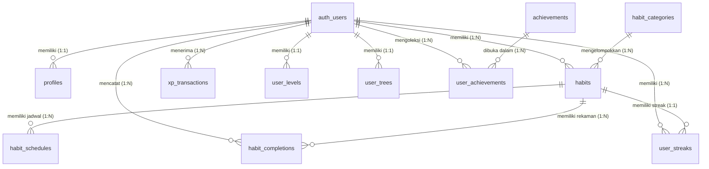
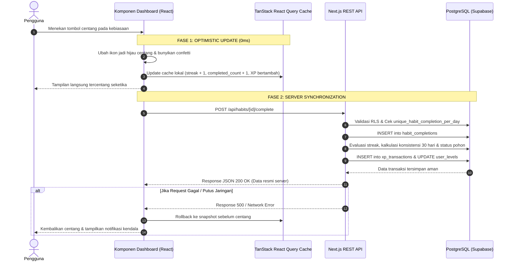
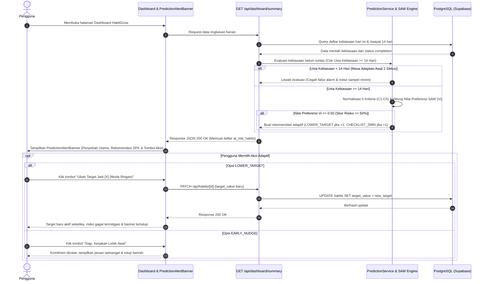
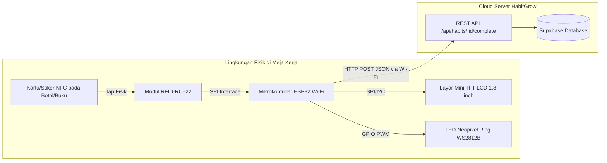

# 🌿 HabitGrow — Dokumen Arsitektur Proyek & Panduan Skripsi Lengkap

> **Versi Dokumen:** 1.2.0  
> **Terakhir Diperbarui:** 24 September 2026  
> **Target Pengguna:** Pengembang, Agen AI (*Context File*), dan Penulisan Laporan Tugas Akhir / Skripsi (Program Studi Sistem Komputer / Teknik Informatika / Sistem Informasi).

---

## 📑 DAFTAR ISI
1. [Ringkasan Eksekutif & Latar Belakang](#1-ringkasan-eksekutif--latar-belakang)
2. [Spesifikasi Kebutuhan Sistem (SRS)](#2-spesifikasi-kebutuhan-sistem-srs)
3. [Arsitektur Perangkat Lunak, Bahasa Pemrograman & Metodologi](#3-arsitektur-perangkat-lunak--teknologi)
   * 3.1 Rincian Tech Stack
   * 3.2 Bahasa Pemrograman yang Digunakan & Peran Spesifiknya
   * 3.3 Metodologi Rekayasa Perangkat Lunak (SDLC) & Riset Akademis
   * 3.4 Landasan Teori Ilmiah & Model Perilaku Pengguna (Behavioral Psychology)
   * 3.5 Arsitektur Distribusi & Generasi File Instalasi Mobile (Android APK)
   * 3.6 Arsitektur Antarmuka Responsif Mobile (Android/iOS), Drawer Hamburger & Eliminasi Containing-Block Bug
4. [Perancangan Basis Data & Skema ERD](#4-perancangan-basis-data--skema-erd)
5. [Formulasi Algoritma & Logika Matematika Inti](#5-formulasi-algoritma--logika-matematika)
   * 5.1 Logika Non-Zero Day Global Daily Streak
   * 5.2 Logika Deteksi & Pemulihan Streak Putus (*Broken Streak*)
   * 5.3 Logika Skor Konsistensi Bergulir 30 Hari (*Rolling Consistency*)
   * 5.4 Logika Siklus Hidup Pohon Virtual (*Tree Growth & Lifecycle*)
   * 5.5 Logika Perhitungan XP & Progresi Level
   * 5.6 Logika Mutasi Antarmuka Instan (*Optimistic UI State & Rollback*)
   * 5.7 Formulasi Sistem Pendukung Keputusan (SPK) Metode SAW: Prediksi Risiko Kegagalan (*Habit Churn*)
6. [Katalog Endpoint RESTful API](#6-katalog-endpoint-restful-api)
7. [Alur Bisnis End-to-End (User Journey & State Machine)](#7-alur-bisnis-end-to-end-user-journey--state-machine)
   * 7.1 Alur Eksekusi Checklist Taktil (Optimistic UI & Server Sync)
   * 7.2 Alur Sistem Pendukung Keputusan (SPK) SAW & Rekomendasi Adaptif
8. [Struktur Direktori & Pemetaan Kode Sumber](#8-struktur-direktori--pemetaan-kode-sumber)
   * 8.1 Identitas Visual, Filosofi Logo & Lokasi Aset Gambar
9. [Cetak Biru Integrasi IoT untuk Skripsi Sistem Komputer](#9-cetak-biru-integrasi-iot-untuk-skripsi-sistem-komputer)
10. [Panduan Penulisan Proposal & Bab Skripsi (Bab 1 s/d Bab 5)](#10-panduan-penulisan-proposal--bab-skripsi)

---

## 1. RINGKASAN EKSEKUTIF & LATAR BELAKANG

### 1.1 Identitas Aplikasi
* **Nama Proyek:** HabitGrow
* **Tagline:** *Gamified Habit Tracker & Virtual Tree Progression System*
* **Platform:** Web Responsive (PWA-ready) & IoT Extensible
* **Paradigma Inti:** *Non-Zero Day Principle*, *Visual Empathy*, *Botanical Metaphor Gamification*, *Decision Support System (DSS) Early Warning*.

### 1.2 Masalah yang Diselesaikan (*Problem Statement*)
Aplikasi pelacak kebiasaan konvensional sering kali gagal mempertahankan retensi pengguna dalam jangka panjang karena:
1. **Efek *Streak Fatigue* & Keputusasaan:** Pada aplikasi biasa, ketika pengguna gagal melakukan kebiasaan selama satu hari saja, *streak* gabungan langsung di-reset ke nol. Hal ini memicu efek psikologis *“what-the-hell effect”*, di mana pengguna merasa semua usahanya sia-sia dan akhirnya meninggalkan aplikasi.
2. **Visualisasi yang Kering dan Monoton:** Hanya berupa daftar checklist teks tanpa representasi visual organik yang mencerminkan pertumbuhan diri.
3. **Latensi Checklist yang Mengganggu:** Ketergantungan pada panggilan jaringan asinkron lambat membuat antarmuka terasa kaku saat mencentang kebiasaan.
4. **Ketiadaan Hubungan dengan Dunia Nyata:** Pelacak digital terisolasi di dalam layar gawai tanpa kehadiran fisik di meja kerja pengguna.
5. **Ketiadaan Sistem Pencegahan Dini Bersifat Prediktif (*Lack of Proactive Early Warning*):** Aplikasi umum bersifat pasif; hanya mencatat kegagalan setelah hari berganti, tanpa memberikan peringatan dini atau rekomendasi adaptif saat pengguna sedang berisiko tinggi melewatkan tugas hari itu.

### 1.3 Solusi HabitGrow
HabitGrow mengatasi masalah tersebut melalui:
* **Algoritma *Non-Zero Day Global Streak*:** Pengguna cukup menyelesaikan minimal 1 kebiasaan apa pun setiap hari agar api *streak* utama tidak padam.
* **Sistem Metafora Pohon Virtual (*Botanical Progression*):** Rutinitas pengguna secara langsung memberi nutrisi pada pohon virtual interaktif yang berevolusi melalui 5 tahap kehidupan (*Seed* $\rightarrow$ *Sprout* $\rightarrow$ *Young Tree* $\rightarrow$ *Healthy Tree* $\rightarrow$ *Mature Tree*).
* **Desain UI Berorientasi Manusia (*Human-Crafted Editorial*):** Menolak tata letak generik buatan AI; mengedepankan sapaan hangat personal, palet warna alam organik, kartu taktil dengan respons 0ms (*Optimistic UI*), dan konfeti perayaan instan.
* **Sistem Pendukung Keputusan (DSS) Deteksi Risiko & Rekomendasi Adaptif (*Simple Additive Weighting - SAW*):** Mengevaluasi kebiasaan yang berisiko terlewat hari ini menggunakan metode Multi-Criteria Decision Making **Simple Additive Weighting (SAW)** dengan 5 kriteria perilaku ($V_i \ge 0.50$), serta menyajikan rekomendasi keputusan preskriptif (*Smart Nudge / Aturan 2 Menit*) 1-klik untuk menurunkan target sementara.
* **Kesiapan Arsitektur IoT (Khusus Skripsi Sistem Komputer):** Backend berbasis REST API murni yang siap menerima pemicu fisik dari mikrokontroler (ESP32/RFID/NFC) maupun perangkat display meja mini.

---

## 2. SPESIFIKASI KEBUTUHAN SISTEM (SRS)

### 2.1 Kebutuhan Fungsional (Functional Requirements)
* **[FR-01] Autentikasi & Profil:** Pengguna dapat mendaftar, masuk, keluar, serta memperbarui nama tampilan dan preferensi zona waktu secara aman.
* **[FR-02] Manajemen Kebiasaan (CRUD):** Pengguna dapat membuat, melihat, memperbarui (Edit Modal), mengarsipkan, dan menghapus kebiasaan dengan kustomisasi ikon, warna hex, tingkat kesulitan (*Easy/Medium/Hard*), target kuantitatif, dan satuan. Konfirmasi penghapusan disajikan melalui modal dialog kustom profesional dengan peringatan risiko kehilangan riwayat data.
* **[FR-03] Penjadwalan Fleksibel:** Sistem mendukung tiga modalitas frekuensi: Harian (*DAILY*), Hari Tertentu (*SELECTED_DAYS*), dan Target Mingguan (*WEEKLY_TARGET*).
* **[FR-04] Eksekusi & Checklist Instan:** Pengguna dapat mencentang kebiasaan harian dengan umpan balik visual instan (0 milidetik) melalui mekanisme *Optimistic UI Update*.
* **[FR-05] Mesin Gamifikasi XP & Level:** Setiap penyelesaian kebiasaan menghasilkan *Experience Points* (XP) berdasarkan tingkat kesulitan yang berkontribusi pada kenaikan level pengguna secara terstruktur.
* **[FR-06] Pelacak Multi-Streak (Global & Individual):** Sistem memelihara *streak* spesifik untuk masing-masing kebiasaan sekaligus menghitung *Global Daily Streak* berbasis prinsip *Non-Zero Day*.
* **[FR-07] Deteksi & Peringatan Streak Putus (*Broken Streak Alert*):** Sistem secara otomatis mendeteksi jika sebuah kebiasaan mengalami putus *streak* pada hari kemarin dan menampilkan banner pemberitahuan yang empatik.
* **[FR-08] Ekosistem Pohon Virtual:** Pertumbuhan dan kesehatan pohon ditentukan oleh skor konsistensi bergulir 30 hari (*Rolling 30-Day Consistency Score*).
* **[FR-09] Sistem Pencapaian (*Achievements*):** Membuka lencana dan trofi khusus ketika pengguna mencapai tonggak sejarah tertentu (misal: *First Step*, *Streak 7 Days*, *Mature Tree*).
* **[FR-10] Analitik & Riwayat:** Menyajikan rekapitulasi data visual, kalender aktivitas, dan distribusi kebiasaan.
* **[FR-11] Filter Dashboard Dinamis:** Memfasilitasi penyaringan daftar tugas hari ini (*Semua*, *Belum Selesai*, *Selesai*).
* **[FR-12] Dukungan Tema Ganda:** Antarmuka responsif dengan transisi mulus antara Mode Gelap (*Dark Mode*) dan Mode Terang (*Light Mode*).
* **[FR-13] Sistem Pendukung Keputusan (DSS) Risiko Kegagalan (*Simple Additive Weighting - SAW*):** Sistem secara proaktif mengevaluasi riwayat 14 hari pengguna menggunakan metode Multi-Criteria Decision Making **Simple Additive Weighting (SAW)** dengan 5 kriteria terbobot ($W_1 = 0.30, W_2 = 0.25, W_3 = 0.15, W_4 = 0.15, W_5 = 0.15$). Jika nilai preferensi $V_i \ge 0.50$ (50%), sistem menyajikan rekomendasi adaptif (*Decision Support Nudge / Aturan 2 Menit*) dengan opsi penyesuaian target kuantitas 1-klik (`PATCH /api/habits/[id]`).

### 2.2 Kebutuhan Non-Fungsional (Non-Functional Requirements)
* **[NFR-01] Latensi Umpan Balik Antarmuka:** Perubahan status visual checklist harus $\le 50\text{ ms}$ di sisi klien tanpa menunggu *round-trip* server selesai.
* **[NFR-02] Integritas Data & Keamanan (RLS):** Seluruh baris data pada PostgreSQL dilindungi oleh *Row Level Security* (RLS) di mana pengguna hanya dapat membaca dan memodifikasi datanya sendiri.
* **[NFR-03] Kepatuhan Standar RESTful:** Seluruh komunikasi klien-server menggunakan protokol HTTP dengan kata kerja standar (`GET`, `POST`, `PATCH`, `DELETE`) dan payload berformat JSON.
* **[NFR-04] Ketersediaan API untuk Eksternal:** API dirancang *stateless* sehingga dapat diakses oleh mikrokontroler IoT dengan autentikasi berbasis Bearer Token / Supabase JWT.
* **[NFR-05] Keandalan Pengujian (*Test Coverage*):** Seluruh modul algoritma matematika inti wajib memiliki *unit tests* terotomatisasi dengan tingkat keberhasilan 100%.
* **[NFR-06] Efisiensi Komputasi Algoritma SPK SAW (Serverless Execution Latency):** Waktu komputasi normalisasi 5 kriteria dan perhitungan nilai preferensi SAW pada serverless runtime harus $\le 10\text{ ms}$ per evaluasi tanpa membebani performa server atau memerlukan microservice Python/GPU terpisah.
* **[NFR-07] Ergonomi Responsif Seluler (Mobile Android & iOS UI/UX):** Antarmuka wajib mematuhi standar ergonomi *thumb zone* seluler (touch target $\ge 40\text{px}$), bilah navigasi bawah (*Bottom Navigation Bar*) terlabuh di dasar viewport dengan perlindungan *safe area* iOS (`env(safe-area-inset-bottom)`), laci navigasi samping (*Slide-over Hamburger Drawer*) untuk rute komprehensif dan profil/logout, serta tata letak metrik *Executive Command Bar* berbasis grid 3-kolom proporsional tanpa wrapping tak beraturan pada resolusi sempit ($360\text{px} - 430\text{px}$).

---

## 3. ARSITEKTUR PERANGKAT LUNAK & TEKNOLOGI

Aplikasi HabitGrow mengadopsi arsitektur modern **Fullstack Jamstack / Micro-Services Ready** dengan pemisahan tegas antara lapisan presentasi, logika bisnis, dan basis data:

```mermaid
graph TD
    subgraph Klien / Frontend (Next.js 16 + React 19)
        UI[Halaman & Komponen UI]
        RQ[TanStack React Query - Cache & Optimistic UI]
        UI -->|Aksi Centang 0ms| RQ
    end

    subgraph Perangkat Eksternal (IoT)
        ESP32[Mikrokontroler ESP32 / RFID Sensor]
    end

    subgraph Lapisan Server / API Routes
        API[Next.js Route Handlers / REST API]
        VAL[Zod Schema Validators]
        SVC[Domain Service Layer]
        ALG[Pure Mathematical Algorithms]
        API --> VAL --> SVC --> ALG
    end

    subgraph Lapisan Basis Data (Supabase Cloud)
        AUTH[Supabase Auth - JWT]
        PG[(PostgreSQL 15)]
        RLS[Row Level Security Engine]
        PG --- RLS
    end

    RQ -->|HTTP REST JSON| API
    ESP32 -->|HTTP POST /api/habits/:id/complete| API
    SVC -->|Supabase SDK / SQL| PG
```

### 3.1 Rincian Tech Stack
* **Framework Frontend:** Next.js 16.3.5 (App Router, Turbopack Engine).
* **Library Antarmuka:** React 19, Lucide React (ikonografi modern), Canvas Confetti (efek selebrasi).
* **Manajemen State & Cache Server:** TanStack React Query v5 (Optimistic Mutations, Automatic Invalidation, Cache Rollback).
* **Styling & Desain:** Tailwind CSS v4, CSS Variables, Nature-inspired HSL color tokens.
* **Backend Runtime:** Node.js 20+ / Next.js Serverless Edge & Node runtime.
* **Mesin Sistem Pendukung Keputusan (DSS):** Multi-Criteria Decision Making (MCDM) metode **Simple Additive Weighting (SAW)** dengan 5 Kriteria Terbobot ($C_1..C_5$) dan normalisasi linear benefit (waktu eksekusi $< 1\text{ ms}$ tanpa ketergantungan API pihak ketiga).
* **Validasi Skema:** Zod v3 (validasi *runtime payload* ketat di sisi klien dan server).
* **Basis Data:** PostgreSQL via Supabase (Auth, Foreign Keys, UUID v4, Triggers, RLS).
* **Unit Testing:** Vitest v5 (menjamin kebenaran algoritma secara deterministik).

---

### 3.2 Bahasa Pemrograman yang Digunakan & Peran Spesifiknya

Untuk keperluan penulisan Bab 3 Skripsi dan pemahaman mendalam AI, berikut adalah taksonomi bahasa pemrograman yang digunakan pada proyek HabitGrow:

| No | Bahasa Pemrograman | Lingkungan / Lapisan | Peran & Tanggung Jawab dalam Sistem |
| :---: | :--- | :--- | :--- |
| 1 | **TypeScript (v5.x)** | Fullstack (Frontend & Backend Route Handlers) | Merupakan bahasa pemrograman utama pada seluruh aplikasi. Menggunakan sistem pengetikan statis (*static typing*), *interface*, dan *generics* untuk mencegah galat *runtime* (*null/undefined pointer*), mempercepat *refactoring*, serta memastikan konsistensi kontrak data antara klien dan server. |
| 2 | **SQL (PostgreSQL 15 Dialect)** | Basis Data (Supabase Cloud) | Digunakan untuk mendefinisikan skema tabel (*DDL*), relasi kunci asing, *unique constraints*, fungsi pemicu (*triggers*), indeks kinerja (B-Tree), dan kebijakan keamanan baris data (*Row Level Security / RLS*). |
| 3 | **CSS3 (Tailwind CSS v4 Engine)** | Frontend Presentation Layer | Mengatur seluruh tata letak visual, responsivitas multi-layar, variabel warna dinamis (HSL), efek kaca (*glassmorphism*), serta transisi *micro-animation* tema terang/gelap. |
| 4 | **HTML5 (Semantic JSX)** | Frontend Structure | Struktur dokumen web berbasis tag semantik (`<header>`, `<main>`, `<section>`, `<article>`), atribut aksesibilitas (*ARIA labels*), dan kepatuhan standar WCAG. |
| 5 | **C / C++ (Arduino Framework)** *(Sub-sistem IoT)* | Firmware Mikrokontroler (ESP32) | Digunakan pada skenario skripsi Sistem Komputer untuk memprogram mikrokontroler ESP32: menginisialisasi modul sensor RFID-RC522 via antarmuka SPI, membaca kartu NFC, mengendalikan layar TFT, serta mengirimkan paket HTTP POST JSON ke server via Wi-Fi. |

---

### 3.3 Metodologi Rekayasa Perangkat Lunak (SDLC) & Riset Akademis

Dalam penyusunan skripsi, proyek ini mengadopsi metodologi pengembangan formal berikut:

#### 1. Model Pengembangan Sistem: *Agile Development with Prototyping*
* **Fase 1: Analisis Kebutuhan (*Requirements Engineering*):** Identifikasi masalah psikologis *streak fatigue*, perumusan Kebutuhan Fungsional (FR) dan Non-Fungsional (NFR).
* **Fase 2: Perancangan Arsitektur (*System Architecture & Database Design*):** Perancangan ERD relasional 13 tabel, pemodelan diagram sekuens, dan spesifikasi REST API.
* **Fase 3: Implementasi Bertahap (*Incremental Sprints*):**
  * *Sprint 1:* Autentikasi dan fondasi CRUD kebiasaan.
  * *Sprint 2:* Implementasi algoritma matematika (*Streak*, *Consistency*, *Level*, *Tree*).
  * *Sprint 3:* Optimasi antarmuka taktil (0ms *Optimistic UI Update*) dan selebrasi visual.
  * *Sprint 4:* Integrasi modul deteksi streak putus dan filter kebiasaan harian.
* **Fase 4: Pengujian & Evaluasi (*Verification & Validation*):** Pengujian unit terotomatisasi (*Unit Testing*) dan pengujian fungsi kotak hitam (*Black-box Testing*).

#### 2. Metodologi Pengujian (*Testing Methodology*):
* **Unit Testing Terotomatisasi (Vitest):** Pengujian unit berbasis pendekatan *Test-Driven Development (TDD)* pada modul algoritma matematika (`src/lib/algorithms/__tests__/`). Menjalankan **31 skenario uji deterministik** (12 uji streak, 6 uji pohon, 5 uji level, 4 uji XP, 4 uji konsistensi) dengan tingkat kelulusan 100%.
* **Blackbox Functional Testing:** Pengujian seluruh rute antarmuka pengguna, validasi form Zod, transisi tema terang/gelap, dan penanganan galat HTTP (400, 401, 500).
* **Network & Latency Testing:** Mengukur perbedaan waktu persepsi pengguna antara rendering optimistik lokal ($\le 10\text{ ms}$) dibandingkan respons jaringan Supabase (rata-rata $150 - 400\text{ ms}$).

---

### 3.4 Landasan Teori Ilmiah & Model Perilaku Pengguna (Behavioral Psychology)

HabitGrow bukan sekadar aplikasi pencatat, melainkan implementasi sistem dari teori-teori psikologi perilaku pembentukan kebiasaan:

1. **Teori *The Habit Loop* (Charles Duhigg & James Clear - *Atomic Habits*):**
   * **Cue (Pemicu):** Tampilan tanggal personal, status kebun harian, serta pemicu fisik meja (*NFC desk tag*).
   * **Routine (Rutinitas):** Pelaksanaan kebiasaan positif yang dicatat melalui checklist taktil.
   * **Reward (Hadiah Instan):** Perolehan XP, animasi konfeti mekar, pembaruan level, dan kesegaran visual pohon virtual.
2. **Prinsip Psikologis *Non-Zero Day*:**
   * Menghilangkan rasa bersalah dan keputusasaan (*the what-the-hell effect*). Filosofi bahwa melakukan 1 kemajuan kecil jauh lebih bermakna daripada tidak sama sekali (0%). Hal ini diterjemahkan ke dalam algoritma *Global Daily Streak*.
3. **Teori Determinasi Diri (*Self-Determination Theory / SDT*) & Kerangka Gamifikasi Octalysis (Yu-kai Chou):**
   * *Development & Accomplishment:* Sistem Level bertingkat dan lencana pencapaian (*Achievements*).
   * *Ownership & Possession:* Pohon virtual yang bertumbuh seiring kedisiplinan diri.
   * *Empowerment of Creativity:* Kebebasan memilih warna, ikon, target kuantitas, dan frekuensi jadwal kebiasaan.

---

### 3.5 Arsitektur Distribusi & Generasi File Instalasi Mobile (Android APK)

Dalam konteks penyelesaian Tugas Akhir / Skripsi yang membutuhkan pengujian langsung pada gawai *smartphone* Android pengguna atau dosen penguji, sistem HabitGrow dirancang untuk dapat diekstrak menjadi **file paket instalasi fisik (`.apk`)**.

#### 1. Tiga Modalitas Pembangkitan File Instalasi Android (`.apk`):
* **Modalitas A: PWABuilder / Trusted Web Activity (TWA) — Instan & Efisien:**
  * Memanfaatkan *Progressive Web App manifest* dan integrasi Chrome Custom Tabs / TWA resmi dari Google.
  * Platform [PWABuilder](https://www.pwabuilder.com) membungkus URL hosting produksi (`https://habit-grow.vercel.app`) menjadi file `HabitGrow.apk` dalam hitungan 5 menit tanpa perlu mengunduh SDK Android Studio berukuran puluhan gigabyte di laptop pengembang.
* **Modalitas B: Capacitor Native Bridge (`@capacitor/android`) — Standar Industri Hybrid:**
  * Mengintegrasikan `@capacitor/core` dan `@capacitor/android` langsung ke repositori Next.js.
  * Mengonfigurasi `capacitor.config.json` dengan parameter `server.url` yang mengarah ke Vercel.
  * Menghasilkan proyek Android Studio native lengkap dengan struktur Gradle, di mana perintah `./gradlew assembleDebug` langsung memproduksi berkas fisik:
    `android/app/build/outputs/apk/debug/app-debug.apk`.
* **Modalitas C: Expo / React Native EAS Cloud Build — Full Native Frontend:**
  * Membangun frontend khusus seluler terpisah yang mengonsumsi Supabase Database dan REST API HabitGrow.
  * Menggunakan kompilasi cloud Expo (`eas build -p android --profile preview`) yang secara otomatis menghasilkan link unduhan file `.apk` mandiri.

#### 2. Justifikasi Akademis: Kebijakan Google Play Store vs. Standar Pengujian Skripsi:
* **Fakta Regulasi Akademis:** Standar kelulusan dan sidang skripsi di perguruan tinggi (berdasarkan panduan BAN-PT dan LAM INFOKOM) menitikberatkan pada validitas algoritma, kesesuaian arsitektur sistem, dan pengujian fungsionalitas (*Blackbox & UAT*).
* **Tidak Ada Keharusan Masuk Play Store:** Penguji tidak mewajibkan aplikasi terdaftar di Google Play Store publik. Kebijakan Google Play Store saat ini yang mewajibkan biaya registrasi $25 USD serta pengujian tertutup 20 orang selama 14 hari merupakan regulasi komersial distribusi massal, bukan parameter keilmuan teknologi informasi.
* **Format Demonstrasi Sidang:** Menghasilkan file instalasi mandiri berformat `.apk` yang dipasang melalui *package installer* (fitur *sideloading*) pada smartphone penguji sudah 100% memenuhi syarat demonstrasi karya perangkat lunak dan dicantumkan secara formal pada Bab 1 sub-bab *Batasan Masalah*.

---

### 3.6 Arsitektur Antarmuka Responsif Mobile (Android/iOS), Drawer Hamburger & Eliminasi Containing-Block Bug

Pengalaman pengguna (*User Experience*) pada peramban seluler (Chrome Android & Safari iOS) memerlukan penanganan arsitektural khusus agar antarmuka tidak mengalami disorientasi visual (*layout shift*) maupun tumpang tindih elemen (*visual clipping*).

#### 1. Identifikasi Akar Masalah & Eliminasi "CSS Containing Block Bug":
* **Gejala Masalah Sebelumnya:** Pada pengujian awal di perangkat seluler Android, bilah navigasi bawah (*Bottom Navigation Bar*) tampak menempel di bagian paling atas layar persis di bawah URL bar Chrome, dengan 6 ikon menu berdesakan dan memicu tumpang tindih dengan header.
* **Akar Masalah Matematis/Spesifikasi CSS:**
  Sesuai spesifikasi W3C CSS Transforms Module Level 1 & Filter Effects Module Level 1:
  $$\text{Jika suatu elemen memiliki } \texttt{backdrop-filter} \ne \text{none}, \text{ maka elemen tersebut menjadi } \textbf{containing block} \text{ baru bagi keturunan } \texttt{position: fixed}.$$
  Karena bilah navigasi seluler sebelumnya diletakkan sebagai anak (*child*) di dalam `<header className="... backdrop-blur-md">`, instruksi `fixed bottom-0` tidak lagi mengacu pada dasar layar *viewport* ponsel, melainkan mengacu pada dasar elemen `<header>` di bagian atas layar!
* **Solusi Arsitektural:** Memindahkan komponen laci navigasi samping (*Slide-over Drawer*) dan bilah navigasi bawah (*Mobile Bottom Navigation Bar*) keluar dari elemen `<header>` menggunakan React Fragments (`<> <header /> <Drawer /> <nav /> </>`). Dengan demikian, `fixed bottom-0` dan `fixed inset-0` secara murni terlabuh pada *root viewport* perangkat.

#### 2. Spesifikasi Slide-Over Hamburger Drawer Navigation:
* **Desain Header Seluler Bersih (*Clean Minimalist Top Header*):** Header seluler di bagian atas hanya menampilkan logo HabitGrow di sebelah kiri dan sakelar tema (`ThemeToggle`) di sebelah kanan. Tombol menu di kanan atas dihilangkan untuk menghindari duplikasi antarmuka (*redundancy*) dengan bilah navigasi bawah.
* **Pemicu Tab Menu Bawah:** Laci navigasi samping (*Slide-over Drawer*) dipicu secara elegan melalui tombol tab `Menu` pada bilah navigasi bawah (*Bottom Nav*), yang berada langsung dalam jangkauan alami ibu jari pengguna (*thumb-zone*).
* **Backdrop Blur & Animasi Sheet:** Ketika tombol ditekan, lembaran drawer samping (`w-[85%] max-w-xs h-full`) muncul dari sisi kanan dengan efek *slide-in-from-right* dan latar belakang semi-transparan `bg-slate-950/60 backdrop-blur-xs`, lengkap dengan tombol penutup silang (`X`) di sudut kanan atas lembaran drawer.
* **Kunci Scroll Tubuh Dokumen (*Body Scroll Lock*):**
  ```typescript
  useEffect(() => {
    if (isMobileMenuOpen) {
      document.body.style.overflow = 'hidden';
    } else {
      document.body.style.overflow = 'unset';
    }
  }, [isMobileMenuOpen]);
  ```
* **Navigasi Rute Komprehensif:** Menyediakan 6 rute lengkap (Dashboard, Kebiasaan, Pohon Virtual, Kalender, Statistik, Pencapaian) dengan target sentuh tinggi $\ge 44\text{px}$, tautan profil pengguna, dan tombol keluar (*logout*) terisolasi.
* **Auto-Close on Route Change:** Drawer otomatis menutup secara mulus saat pengguna menavigasi ke halaman baru melalui *listener* `pathname`.

#### 3. Bilah Navigasi Bawah Ergonomis (*Ergonomic Mobile Bottom Nav*):
* **Optimasi Thumb-Zone (5 Tab Utama):** Disederhanakan menjadi 5 tab berjarak seimbang: `Beranda`, `Kebiasaan`, `Pohon`, `Kalender`, dan `Menu` (yang membuka Hamburger Drawer).
* **Perlindungan Safe-Area iOS:** Menggunakan utilitas dinamis `pb-[max(0.375rem,env(safe-area-inset-bottom))]` guna mencegah tab navigasi terhalang oleh garis bilah beranda (*home indicator bar*) pada iPhone modern.
* **Layout Offset:** Elemen `<main>` pada `app/layout.tsx` dilengkapi padding bawah `pb-24 md:pb-12` agar konten terbawah kartu tugas tidak pernah tertutup oleh bilah navigasi.

#### 4. Tata Letak Dashboard Command Bar & Habit Card Ramah Sentuh:
* **Metrik 3-Kolom Rapat:** Tiga kartu statistik inti (Streak, Level XP, Konsistensi) diorganisasikan dalam grid 3-kolom seimbang (`grid grid-cols-3 gap-2 w-full`) dengan teks ringkas terpotong rapi (*no wrapping*), diikuti tombol "+ Tambah Kebiasaan" selebar penuh (*full-width CTA*) di bawahnya agar mudah dijangkau ibu jari pengguna dengan satu tangan.
* **Header & Tab Filter Seluler:** Judul "Rencana Kebiasaan Hari Ini" dan tombol "Kelola Semua" terkunci rapi pada satu baris (`flex items-center justify-between`), serta tab filter `Semua`, `Belum`, `Selesai` terbagi proporsional 3-kolom rata di layar sempit.
* **Kartu Kebiasaan (*HabitCard*):** Diberi padding rapat `p-3.5 sm:p-5`, avatar ikon `w-10 h-10`, lencana kategori mikro, serta tombol centang lingkaran taktil berukuran optimal (`w-9 h-9 sm:w-11 sm:h-11`) dengan utilitas `touch-manipulation` untuk respons sentuhan berlatensi 0ms.

---

## 4. PERANCANGAN BASIS DATA & SKEMA ERD

Basis data HabitGrow dirancang dalam bentuk relasional normalisasi ketiga (3NF) dengan total **13 tabel terstruktur**.

### 4.1 Diagram Hubungan Entitas (ERD)



### 4.2 Kamus Data & Spesifikasi Tabel

#### 1. Tabel `profiles`
Menyimpan atribut personal pengguna yang terhubung langsung dengan tabel `auth.users` bawaan Supabase.
* `id` (UUID, Primary Key, FK ke `auth.users.id` ON DELETE CASCADE)
* `display_name` (VARCHAR 100, Nama tampilan yang disapa di dashboard)
* `avatar_url` (TEXT, Tautan foto profil pengguna)
* `timezone` (VARCHAR 50, Default: 'UTC')
* `role` (VARCHAR 20, Nilai: 'USER', 'ADMIN')
* `created_at`, `updated_at` (TIMESTAMPTZ)

#### 2. Tabel `habit_categories`
Daftar kategori untuk mengelompokkan kebiasaan.
* `id` (UUID, Primary Key)
* `name` (VARCHAR 100, contoh: 'Fitness', 'Learning', 'Cleaning', 'Health')
* `slug` (VARCHAR 100, Unik)
* `icon` (VARCHAR 50, identifier ikon Lucide)
* `description` (TEXT)
* `is_active` (BOOLEAN, Default: true)

#### 3. Tabel `habits`
Entitas utama kebiasaan yang dibuat oleh pengguna.
* `id` (UUID, Primary Key)
* `user_id` (UUID, FK ke `auth.users.id` ON DELETE CASCADE)
* `category_id` (UUID, FK ke `habit_categories.id` ON DELETE SET NULL)
* `name` (VARCHAR 100, Judul kebiasaan)
* `description` (TEXT)
* `icon` (VARCHAR 50, Ikon kartu)
* `color` (VARCHAR 30, Kode HEX warna aksen)
* `difficulty` (VARCHAR 20, Enum: 'EASY', 'MEDIUM', 'HARD')
* `frequency_type` (VARCHAR 30, Enum: 'DAILY', 'SELECTED_DAYS', 'WEEKLY_TARGET')
* `target_value` (NUMERIC 10,2, Nilai target kuantitas)
* `target_unit` (VARCHAR 50, Satuan target, misal: 'kali', 'halaman', 'menit')
* `start_date` (DATE, Tanggal kebiasaan dimulai)
* `end_date` (DATE, Opsional)
* `reminder_time` (TIME, Waktu notifikasi)
* `is_active` (BOOLEAN, Default: true)
* `is_archived` (BOOLEAN, Default: false)

#### 4. Tabel `habit_schedules`
Rincian hari spesifik jika kebiasaan menggunakan frekuensi `SELECTED_DAYS`.
* `id` (UUID, Primary Key)
* `habit_id` (UUID, FK ke `habits.id` ON DELETE CASCADE)
* `day_of_week` (INTEGER, 0 = Minggu, 1 = Senin, ..., 6 = Sabtu)

#### 5. Tabel `habit_completions`
Log transaksi penyelesaian kebiasaan harian.
* `id` (UUID, Primary Key)
* `habit_id` (UUID, FK ke `habits.id` ON DELETE CASCADE)
* `user_id` (UUID, FK ke `auth.users.id` ON DELETE CASCADE)
* `date` (DATE, Tanggal pengerjaan)
* `completed_at` (TIMESTAMPTZ, Waktu tepat penyelesaian)
* `value` (NUMERIC 10,2, Kuantitas yang diselesaikan)
* `xp_earned` (INTEGER, Jumlah XP yang didapat saat itu)
* *Constraint Unik:* `UNIQUE(habit_id, date)` menjamin kebiasaan hanya bisa diselesaikan 1 kali per hari kalender.

#### 6. Tabel `xp_transactions`
Buku besar (*ledger*) perolehan pengalaman pengguna.
* `id` (UUID, Primary Key)
* `user_id` (UUID, FK ke `auth.users.id`)
* `source_type` (VARCHAR 50, contoh: 'habit_completion', 'achievement', 'bonus')
* `source_id` (UUID, Referensi ke entitas pemicu)
* `amount` (INTEGER, Nominal XP)
* `created_at` (TIMESTAMPTZ)

#### 7. Tabel `user_levels`
Status level progresif pengguna.
* `user_id` (UUID, Primary Key, FK ke `auth.users.id`)
* `level` (INTEGER, Default: 1)
* `total_xp` (INTEGER, Akumulasi seluruh XP)

#### 8. Tabel `user_streaks`
Pencatatan rekor konsistensi berturut-turut untuk setiap kebiasaan.
* `id` (UUID, Primary Key)
* `user_id` (UUID, FK ke `auth.users.id`)
* `habit_id` (UUID, FK ke `habits.id`)
* `current_streak` (INTEGER, Streak berjalan)
* `longest_streak` (INTEGER, Rekor terbaik)
* `last_completed_date` (DATE, Tanggal terakhir centang)

#### 9. Tabel `user_trees`
Representasi virtual pohon tanaman pengguna.
* `user_id` (UUID, Primary Key, FK ke `auth.users.id`)
* `stage` (VARCHAR 50, Tahapan: 'Seed', 'Sprout', 'Young Tree', 'Healthy Tree', 'Mature Tree')
* `health` (INTEGER, Nilai 0 sampai 100)
* `consistency_score` (NUMERIC 5,2, Nilai 0.00 sampai 100.00%)
* `growth_points` (INTEGER)

#### 10. Tabel `achievements` & `user_achievements`
Katalog lencana dan tabel penghubung (*junction table*) pembukaan pencapaian.
* `condition_type` ('first_step', 'streak_days', 'total_completions', 'consistency_rate', 'tree_stage')
* `condition_value` (INTEGER, Batas ambang pembukaan)
* `xp_reward` (INTEGER, Hadiah XP saat lencana terbuka)

---

## 5. FORMULASI ALGORITMA & LOGIKA MATEMATIKA

Di dalam laporan Skripsi, bagian ini merupakan materi krusial untuk **Bab 3 (Metodologi Penelitian & Perancangan Sistem)**.

### 5.1 Algoritma *Non-Zero Day Global Daily Streak*
*Berkas Implementasi:* `src/lib/algorithms/streak.ts` $\rightarrow$ `calculateGlobalDailyStreak()`

#### Definisi Masalah:
Bagaimana cara menghitung hari beruntun pengguna tanpa menghukum pengguna jika salah satu dari banyak tugas terlewat, selama pengguna tetap berprogres minimal pada satu tugas?

#### Formulasi Matematis:
Misalkan $D_{active} = \{d_1, d_2, \dots, d_n\}$ adalah himpunan tanggal unik terurut di mana pengguna menyelesaikan sekurang-kurangnya satu kebiasaan ($\sum \text{completions}(d_i) \ge 1$).

Misalkan $d_{today}$ adalah tanggal hari evaluasi saat ini, dan $d_{yesterday} = d_{today} - 1\text{ hari}$.

1. **Kondisi Reset Streak ke Nol:**
   $$\text{CurrentStreak} = 0 \iff (d_{today} \notin D_{active}) \land (d_{yesterday} \notin D_{active})$$
2. **Kondisi Berjalan (*Active In-Progress*):**
   * Jika $d_{today} \in D_{active}$, penghitungan mundur (*backward walk*) dimulai dari $d_{today}$.
   * Jika $d_{today} \notin D_{active}$ namun $d_{yesterday} \in D_{active}$, hari ini dianggap masih berlangsung (*grace period*) dan penghitungan mundur dimulai dari $d_{yesterday}$.
3. **Akumulasi Streak Berjalan:**
   $$\text{CurrentStreak} = k \quad \text{di mana } \forall i \in [0, k-1], \, (d_{start} - i) \in D_{active} \text{ dan } (d_{start} - k) \notin D_{active}$$
4. **Rekor Streak Terpanjang (*Longest Streak*):**
   $$\text{LongestStreak} = \max_{j} (\text{ConsecutiveDays}_j)$$

#### 5.1.1 Perbedaan Streak Global vs. Streak Individual Kebiasaan (*Per-Habit Streak*):
* **Streak Global (Ditampilkan pada Command Bar Atas):** Berprinsip *Non-Zero Day*. Selama pengguna menyelesaikan minimal 1 kebiasaan apapun setiap hari, streak global akun tetap hidup.
* **Streak Individual (Ditampilkan pada Masing-Masing Kartu Kebiasaan):**
  * Terikat ketat pada jadwal masing-masing kebiasaan (`DAILY`, `SELECTED_DAYS`, `WEEKLY_TARGET`).
  * Jika suatu kebiasaan dijadwalkan kemarin ($d_{yesterday}$) dan tidak diselesaikan, maka streak individual kebiasaan tersebut **hangus dan di-reset ke 0**.
* **Mekanisme Sinkronisasi Otomatis (*Self-Healing Streak Sync*):**
  * *Berkas:* `src/lib/services/streak.service.ts` $\rightarrow$ `recalculateAllUserStreaks()`
  * Karena basis data Supabase menyimpan `user_streaks` secara statis, ketika pengguna melewati hari tanpa mencentang tugas, mutasi `completeHabit` tidak terpanggil.
  * Setiap kali dashboard dibuka (`GET /api/dashboard/summary`), sistem secara otomatis menjalankan `recalculateAllUserStreaks(supabase, userId, evalDate)` di latar belakang. Fungsi ini mengevaluasi seluruh riwayat centang terhadap tanggal evaluasi lokal, mendeteksi tugas yang terlewat kemarin, dan menyinkronkan nilai `current_streak: 0` ke dalam basis data secara instan.

---

### 5.2 Algoritma Deteksi & Pemulihan Streak Putus (*Broken Streak Detection*)
*Berkas Implementasi:* `src/lib/algorithms/streak.ts` $\rightarrow$ `detectBrokenStreak()`

#### Tujuan:
Mendeteksi kegagalan pada hari terjadwal terakhir dan menghitung berapa hari *streak* yang hilang untuk memicu empati dan notifikasi pemulihan.

#### Logika:
1. Dapatkan tanggal terjadwal terakhir sebelum hari ini: $d_{last\_sched} < d_{today}$.
2. Jika $d_{last\_sched} \in \text{Completions}$, maka $\text{isBroken} = \text{false}$.
3. Jika $d_{last\_sched} \notin \text{Completions}$ dan rentang waktu $(d_{today} - d_{last\_sched}) \le 3\text{ hari}$:
   * Hitung hari beruntun sebelum $d_{last\_sched}$ yang berhasil diselesaikan:
   $$\text{LostStreak} = \sum_{i=1}^{m} 1 \quad \text{selama } (d_{last\_sched} - i) \in \text{Completions}$$
   * Jika $\text{LostStreak} > 0$, maka $\text{isBroken} = \text{true}$ dan sistem mengeluarkan banner peringatan.

---

### 5.3 Algoritma Skor Konsistensi Bergulir 30 Hari (*Rolling Consistency Score*)
*Berkas Implementasi:* `src/lib/algorithms/consistency.ts` $\rightarrow$ `calculateOverallConsistency()`

#### Definisi Matematis:
Konsistensi diukur secara proporsional berbobot (*weighted completion rate*) dalam jendela 30 hari terakhir:

$$C = \left( \frac{\sum_{i=1}^{N} \min(\text{Completed}_i, \text{Scheduled}_i)}{\sum_{i=1}^{N} \text{Scheduled}_i} \right) \times 100\%$$

*Jika $\sum \text{Scheduled}_i = 0$, maka $C = 0\%$.*  
*Nilai $C$ di-clamp ketat pada interval $[0.00, 100.00]$.*

---

### 5.4 Algoritma Siklus Hidup Pohon Virtual (*Tree Growth & Health Lifecycle*)
*Berkas Implementasi:* `src/lib/algorithms/tree.ts` $\rightarrow$ `calculateTreeStage()`

#### Aturan Ambang Batas (*Thresholds*):
Tahap visual pohon ($S$) dipetakan secara deterministik berdasarkan skor konsistensi $C$:

$$S(C) = \begin{cases} 
\text{Seed (Benih)} & 0.00 \le C < 20.00 \\
\text{Sprout (Tunas)} & 20.00 \le C < 40.00 \\
\text{Young Tree (Pohon Muda)} & 40.00 \le C < 60.00 \\
\text{Healthy Tree (Pohon Sehat)} & 60.00 \le C < 80.00 \\
\text{Mature Tree (Pohon Dewasa)} & 80.00 \le C \le 100.00
\end{cases}$$

#### Rumus Poin Menuju Evolusi Berikutnya:
$$\Delta C_{next} = \max(0, \text{Threshold}_{next} - C)$$

---

### 5.5 Algoritma XP & Kurva Pertumbuhan Level
*Berkas Implementasi:* `src/lib/algorithms/xp.ts` & `src/lib/algorithms/level.ts`

#### Formula Hadiah XP:
$$\text{XP}_{earned} = \begin{cases} 
10\text{ XP} & \text{Difficulty} = \text{EASY} \\
15\text{ XP} & \text{Difficulty} = \text{MEDIUM} \\
20\text{ XP} & \text{Difficulty} = \text{HARD}
\end{cases}$$

#### Tabel Progresi Level:
| Level | Rentang Total XP | XP Perlu di Level Tersebut |
| :---: | :---: | :---: |
| 1 | 0 – 99 | 100 XP |
| 2 | 100 – 249 | 150 XP |
| 3 | 250 – 449 | 200 XP |
| 4 | 450 – 699 | 250 XP |
| 5 | 700 – 999 | 300 XP |
| 6 | 1000 – 1349 | 350 XP |
| 7 | 1350 – 1749 | 400 XP |
| $\dots$ | $\dots$ | $+50\text{ XP per level}$ |

---

### 5.6 Logika Mutasi Antarmuka Instan (*Optimistic UI State & Rollback Logic*)
*Berkas Implementasi:* `src/components/habits/HabitCard.tsx` & `src/app/app/dashboard/page.tsx`

#### Masalah yang Diselesaikan:
Dalam aplikasi pelacak kebiasaan, jeda jaringan sebesar $200 - 500\text{ ms}$ saat menekan centang merusak kepuasan psikologis (*dopamine hit*) pengguna.

#### Alur Logika Klien-Server:
1. **Langkah 1 (0ms - Klien):** Saat pengguna mengklik tombol centang:
   * Status lokal `isCompleted` langsung diubah menjadi `true`.
   * Partikel konfeti (`canvas-confetti`) langsung diledakkan seketika.
   * `queryClient.cancelQueries(['dashboard-summary'])` dijalankan untuk mencegah refetch yang menimpa state sementara.
   * Snapshot data cache lama disimpan ke memori: `previousSummary = queryClient.getQueryData(...)`.
2. **Langkah 2 (Kalkulasi Optimistik Cache):**
   * `completed_count` ditambah 1.
   * `completion_percentage` dihitung ulang secara instan.
   * Jika ini kebiasaan pertama hari ini, `streak.current_streak` dinaikkan secara optimistik.
   * `user_level.total_xp` ditambahkan dengan `xp_reward`.
3. **Langkah 3 (Sinkronisasi Asinkron):**
   * HTTP POST dikirim ke `/api/habits/[id]/complete`.
4. **Langkah 4 (Penanganan Kegagalan / Rollback):**
   * Jika respons server gagal (misal: koneksi terputus atau HTTP 500), `onError` dipicu:
     * `queryClient.setQueryData(['dashboard-summary'], context.previousSummary)` mengembalikan antarmuka ke keadaan awal secara otomatis tanpa merusak integritas state.

---

### 5.7 Formulasi Sistem Pendukung Keputusan (SPK) Metode Simple Additive Weighting (SAW)
*Berkas Implementasi:* `src/lib/algorithms/prediction.ts` & `src/lib/services/prediction.service.ts`

#### Definisi & Masalah yang Diselesaikan:
Sistem secara proaktif mengevaluasi kebiasaan terjadwal yang memiliki tingkat kerentanan kegagalan/terlewat pada hari ini menggunakan metode Multi-Criteria Decision Making (MCDM) **Simple Additive Weighting (SAW)**. Ketika skor preferensi risiko mencapai ambang batas $V_i \ge 0.50$ (atau $50\%$) setelah masa adaptasi 14 hari, sistem menyajikan rekomendasi adaptif (*Smart Decision Support Nudge*) seperti penurunan target kuantitas sementara untuk mencegah pemutusan *streak*.

#### Kriteria Keputusan ($C_1 \dots C_5$) dan Pembobotan ($W$):
Seluruh kriteria bertipe **Benefit** (semakin tinggi nilainya, semakin besar risiko kebiasaan tersebut berpotensi terlewat/gagal hari ini). Total bobot $\sum_{j=1}^{5} W_j = 1.00$ (100%):

1. **$C_1$ — Recent Miss Rate 14 Hari Terakhir (Bobot $W_1 = 0.30$ / 30%):**
   Rasio hari terjadwal yang terlewat dalam 2 minggu terakhir:
   $$C_1 = \frac{\text{Jumlah Jadwal Terlewat}}{\text{Jumlah Total Jadwal 14 Hari Terakhir}} \in [0.0, 1.0]$$
2. **$C_2$ — Day-of-Week Vulnerability (Bobot $W_2 = 0.25$ / 25%):**
   Rasio historis kegagalan khusus pada hari yang sama dalam seminggu selama 14 hari terakhir (menangkap 2 siklus kalender penuh):
   $$C_2 = \frac{\text{Terlewat pada Hari Serupa}}{\text{Jadwal pada Hari Serupa 14 Hari Terakhir}} \in [0.0, 1.0]$$
3. **$C_3$ — Daily Cognitive Workload / Fatigue (Bobot $W_3 = 0.15$ / 15%):**
   Akumulasi bobot kesulitan kebiasaan yang terjadwal hari ini (Easy: 1, Medium: 2, Hard: 3), dinormalisasi terhadap ambang kelelahan 16 poin:
   $$C_3 = \min\left(1.0, \frac{\text{Total Poin Kesulitan Hari Ini}}{16}\right)$$
4. **$C_4$ — Habit Maturity & Fragility (Bobot $W_4 = 0.15$ / 15%):**
   Faktor kerentanan usia kebiasaan sejak dibuat. Kebiasaan baru masih dalam fase penyesuaian:
   $$C_4 = \begin{cases} 
   0.85, & \text{jika usia} < 7\text{ hari (fase kritis)} \\
   0.65, & \text{jika } 7 \le \text{usia} \le 13\text{ hari} \\
   0.35, & \text{jika } 14 \le \text{usia} \le 29\text{ hari (mulai stabil)} \\
   0.12, & \text{jika usia} \ge 30\text{ hari (kebiasaan matang/terbentuk)}
   \end{cases}$$
5. **$C_5$ — Late Hour Procrastination (Bobot $W_5 = 0.15$ / 15%):**
   Pola penundaan waktu pengerjaan berdasarkan rata-rata jam penyelesaian riwayat:
   $$C_5 = \begin{cases} 
   0.85, & \text{jika rata-rata jam} \ge 22.00\text{ (larut malam, rawan tertidur)} \\
   0.65, & \text{jika } 20.00 \le \text{rata-rata jam} < 22.00 \\
   0.40, & \text{jika } 16.00 \le \text{rata-rata jam} < 20.00 \\
   0.15, & \text{jika rata-rata jam} < 16.00\text{ (pagi / siang hari)}
   \end{cases}$$

#### Normalisasi Matriks ($R$) & Formulasi Nilai Preferensi SAW ($V_i$):
Karena seluruh nilai kriteria $C_1 \dots C_5$ telah terpetakan secara proporsional dalam domain skala $[0.0, 1.0]$, maka elemen matriks ternormalisasi bernilai $R_{ij} = C_j$.

Formulasi nilai preferensi alternatif kebiasaan ke-$i$ ($V_i$):
$$V_i = \sum_{j=1}^{5} W_j \cdot R_{ij}$$
$$V_i = (0.30 \cdot C_1) + (0.25 \cdot C_2) + (0.15 \cdot C_3) + (0.15 \cdot C_4) + (0.15 \cdot C_5)$$

Skor Persentase Risiko Kegagalan:
$$\text{Failure Percentage} = \min(99, \max(1, \text{round}(V_i \times 100)))$$

#### Klasifikasi Tingkat Risiko & Deteksi Faktor Dominan:
* **Tingkat Risiko:**
  * `HIGH` ($V_i \ge 0.70$ atau Skor $\ge 70\%$)
  * `MODERATE` ($0.50 \le V_i < 0.70$ atau Skor $50\% - 69\%$)
  * `LOW / AMAN` ($V_i < 0.50$ atau Skor $< 50\%$, tidak memicu banner)
* **Explainability (Faktor Dominan):** Sistem mengurutkan kontribusi terbobot ($W_j \cdot R_{ij}$) dan menetapkan kriteria dengan nilai terbobot tertinggi sebagai penyebab utama risiko untuk ditampilkan secara transparan kepada pengguna.

#### Landasan Ilmiah Pemilihan Jendela 14 Hari & Cold-Start Guard:
Penetapan jendela observasi dan ambang batas aktivasi model prediktif pada **14 hari (2 minggu)** didasarkan pada tiga pertimbangan metodologis dan psikologis:
1. **Mengatasi Masalah Sampel Minim (*Small Sample Noise*):**
   Jika pengguna memiliki kebiasaan yang hanya dijadwalkan 2 kali seminggu (misalnya Senin dan Kamis), jendela 7 hari hanya menangkap 1 kali kesempatan per hari tersebut. Jika pengguna melewatkannya sekali saja karena urusan darurat, tingkat kegagalan (*miss rate*) seketika melonjak menjadi $100\%$ ($1/1$). Hal ini memicu *false alarm* (peringatan palsu) yang mengganggu kenyamanan pengguna.
2. **Menangkap 2 Siklus Kalender Lengkap:**
   Dengan rentang 14 hari, setiap hari dalam seminggu memiliki minimal 2 titik data evaluasi. Rasio keterlewatan menjadi lebih terdistribusi secara wajar ($0\%$, $50\%$, atau $100\%$), sehingga nilai fitur $X_1$ (*Miss Rate*) dan $X_2$ (*Day-of-Week Vulnerability*) menjadi jauh lebih representatif dan stabil.
3. **Keseimbangan Memori (*Recency vs. Baseline Memory Balance*):**
   Rentang 30 hari terlalu lambat dalam mendeteksi kejenuhan pengguna (*burnout*), sedangkan 7 hari terlalu reaktif terhadap anomali sesaat. Rentang 14 hari (2 minggu) adalah *sweet spot* psikologis untuk mendeteksi tren penurunan motivasi sebelum kebiasaan benar-benar ditinggalkan.

#### Aturan Tindakan Adaptif (*Adaptive Nudge Action*):
* **Cold-Start Guard (Filter Ambang Batas 2 Minggu / 14 Hari):**
  * Kebiasaan baru dengan usia $< 14\text{ hari}$ berada dalam *initial onboarding baseline period*. Peringatan prediksi risiko dini otomatis **dinonaktifkan** selama 14 hari pertama untuk menangkap 2 siklus kalender utuh dan mencegah *false alarm* pada pengguna atau kebiasaan baru.
* **Kriteria Evaluasi ($P \ge 60\%$ setelah 14 hari):**
  * Diklasifikasikan sebagai `HIGH` ($P \ge 70\%$) atau `MODERATE` ($60\% \le P < 70\%$).
  * **Jalur 1 — Tipe Kuantitatif (`target_value > 1` atau Satuan Jam/Liter):**
    * *Pesan Rekomendasi:* `"Beban hari ini terdeteksi tinggi. Amankan streak dengan memangkas target menjadi [X] [Satuan]."`
    * *Formulasi Pangkas:* $\text{Target Baru} = \max\left(1, \left\lfloor \frac{\text{Target Lama}}{2} \right\rfloor\right)$.
    * *Konversi Cerdas Satuan:*
      * Jika `target_unit: 'jam'` dan target bernilai 1, sistem otomatis mengonversinya menjadi **30 menit**.
      * Jika `target_unit: 'liter'` (atau `'l'`) dan target bernilai 1, sistem otomatis mengonversinya menjadi **500 ml** (setara 2 gelas air).
    * *Aksi Tombol Utama:* `[⚡ Pangkas Target Jadi [X] [Satuan]]` yang mengeksekusi `PATCH /api/habits/[id]` seketika.
    * *Aksi Sekunder:* `[Saya Sanggup Target Normal]` yang menutup banner tanpa memodifikasi data kebiasaan.
  * **Jalur 2 — Tipe Biner / Checklist (`target_value = 1` Non-Jam/Liter):**
    * *Pesan Rekomendasi:* `"[Nama] biasanya rawan terlewat di hari [Hari]. Gunakan prinsip 2 menit: lakukan versi teringan sekarang agar pohon virtualmu tidak kekurangan nutrisi."`
    * *Aksi Tombol Utama:* `[✓ Tandai Selesai Cepat (2 Menit)]` yang langsung mengeksekusi `POST /api/habits/[id]/complete` dengan ledakan konfeti dan pembaruan antarmuka instan (0ms).
    * *Aksi Alternatif:* `[⏰ Ingatkan 1 Jam Lagi]` yang menunda (*snooze*) penayangan banner peringatan selama 60 menit via *client-side local storage*.
* **Penyajian Antarmuka Antirumpang:**
  * Komponen `PredictionAlertBanner` menyajikan kotak *callout* rekomendasi AI secara visual dan eksplisit sehingga pengguna mendapatkan instruksi tindakan yang jelas sebelum memilih opsi.

---

### 5.8 Manajemen Zona Waktu & Siklus Pergantian Hari (*Timezone Synchronization & Midnight Reset*)
*Berkas Implementasi:* `src/app/api/dashboard/summary/route.ts`, `src/lib/services/habit.service.ts`, `src/lib/algorithms/schedule.ts`, `src/app/app/dashboard/page.tsx`

#### Masalah Zona Waktu Serverless (UTC vs Waktu Lokal):
* Server *cloud/serverless* (seperti Vercel) mengeksekusi fungsi backend dalam zona waktu **UTC (GMT+0)**.
* Di Indonesia (WIB UTC+7, WITA UTC+8, WIT UTC+9), jam 00:00 (tengah malam) waktu lokal setara dengan jam 16:00-17:00 UTC kemarin.
* Jika backend hanya mengandalkan `new Date()` internal server tanpa parameter tanggal lokal klien:
  1. Pergantian hari baru (*reset checklist*) di sisi server baru akan terjadi saat jam 07:00 WIB / 08:00 WITA (tengah malam UTC).
  2. Antara jam 00:00 hingga 08:00 pagi waktu lokal, pengguna melihat tanggal sudah berganti (misal: Sabtu), namun checklist masih menampilkan status centang dari hari sebelumnya (Jumat) karena server masih menganggapnya hari Jumat.

#### Solusi Arsitektur (*Client-Anchored Date Evaluation*):
1. **Query Param `?date=YYYY-MM-DD`:**
   Setiap permintaan data agregasi dashboard (`GET /api/dashboard/summary?date=...`) dan analitik menyertakan tanggal lokal perangkat pengguna (`toDateString(new Date())`).
2. **Pencatatan Checklist Sinkron:**
   Saat pengguna menekan centang kebiasaan, mutasi `POST /api/habits/[id]/complete` mengirimkan `{ date: localDate }` sehingga catatan penyelesaian di database terikat presisi pada tanggal kalender lokal pengguna.
3. **Penyelarasan Algoritma:**
   Semua fungsi evaluasi (`getTodayHabits`, `calculateUserGlobalStreak`, `detectBrokenStreaks`, dan `getAtRiskHabitsToday`) menerima parameter `evalDate` yang diselaraskan dengan tanggal kalender pengguna, memastikan siklus reset habit terjadi tepat pukul **00:00 (tengah malam) waktu lokal masing-masing pengguna**.

---

## 6. KATALOG ENDPOINT RESTFUL API

Seluruh endpoint menerima header `Content-Type: application/json` dan cookie sesi / Bearer Token Supabase untuk otentikasi.

| Method | Endpoint URI | Fungsi & Deskripsi | Request Body / Query | Format Response Utama | Status Code |
| :--- | :--- | :--- | :--- | :--- | :--- |
| **POST** | `/api/auth/register` | Mendaftarkan akun pengguna baru | `{ email, password, full_name }` | `{ success: true, user }` | `201 Created` |
| **POST** | `/api/auth/login` | Masuk ke sistem | `{ email, password }` | `{ success: true, session }` | `200 OK` |
| **POST** | `/api/auth/logout` | Menghapus sesi otentikasi | *-* | `{ success: true }` | `200 OK` |
| **GET** | `/api/dashboard/summary` | Mengambil data agregasi dashboard (mendukung zona waktu lokal) | `?date=YYYY-MM-DD` | `{ success: true, data: DashboardSummary }` | `200 OK` |
| **GET** | `/api/calendar/activity` | Mengambil data riwayat aktivitas kebiasaan tahunan & bulanan | `?year=2026` | `{ success: true, data: CalendarActivityResponse }` | `200 OK` |
| **GET** | `/api/calendar/day` | Mengambil rincian kebiasaan terjadwal per tanggal | `?date=YYYY-MM-DD` | `{ success: true, data: CalendarDayDetail }` | `200 OK` |
| **GET** | `/api/habits` | Mendapatkan seluruh kebiasaan user | `?archived=false&categoryId=...` | `{ success: true, data: HabitItem[] }` | `200 OK` |
| **POST** | `/api/habits` | Membuat kebiasaan baru | `{ name, category_id, difficulty, frequency_type, ... }` | `{ success: true, data: Habit }` | `201 Created` |
| **PATCH**| `/api/habits/[id]` | Memperbarui nama/target kebiasaan | `{ name?, target_value?, ... }` | `{ success: true, data: Habit }` | `200 OK` |
| **DELETE**| `/api/habits/[id]`| Menghapus kebiasaan secara permanen | *-* | `{ success: true }` | `200 OK` |
| **POST** | `/api/habits/[id]/complete` | **Mencatat checklist kebiasaan hari ini** | `{ date?: string, note?: string }` | `{ success: true, data: { xp_earned, streak, tree } }` | `200 OK` |
| **GET** | `/api/categories` | Mendapatkan daftar kategori aktif | *-* | `{ success: true, data: Category[] }` | `200 OK` |
| **GET** | `/api/achievements` | Mendapatkan daftar pencapaian user | *-* | `{ success: true, data: Achievement[] }` | `200 OK` |
| **GET** | `/api/analytics/weekly` | Mendapatkan performa mingguan per tanggal lokal | `?date=YYYY-MM-DD` | `{ success: true, data: WeeklyChartData[] }` | `200 OK` |
| **GET** | `/api/analytics/performance` | Mendapatkan ringkasan performa kebiasaan | `?date=YYYY-MM-DD` | `{ success: true, data: PerformanceSummary }` | `200 OK` |

---

## 7. ALUR BISNIS END-TO-END (USER JOURNEY & STATE MACHINE)

### 7.1 Alur Eksekusi Checklist Taktil (Optimistic UI & Server Sync)



### 7.2 Alur Sistem Pendukung Keputusan (SPK) SAW & Nudge Adaptif



---

## 8. STRUKTUR DIREKTORI & PEMETAAN KODE SUMBER

```text
HabitGrow/
├── src/
│   ├── app/                                # Next.js 16 App Router
│   │   ├── (auth)/                         # Rute Publik (Login, Register)
│   │   ├── app/                            # Rute Terproteksi
│   │   │   ├── dashboard/page.tsx          # Dashboard Utama (Executive Command Bar & 2-Col Grid)
│   │   │   ├── habits/page.tsx             # Manajemen Daftar Kebiasaan
│   │   │   ├── tree/page.tsx               # Halaman Detail Sanctuary Pohon
│   │   │   ├── calendar/page.tsx           # Kalender Bulanan Interaktif Per-Bulan & Per-Tanggal (Senin s/d Minggu)
│   │   │   ├── statistics/page.tsx         # Grafik Analisis & Heatmap
│   │   │   └── achievements/page.tsx       # Galeri Trofi & Pencapaian
│   │   └── api/                            # Backend REST API Endpoints
│   │       ├── auth/                       # API Auth Login/Register/Logout
│   │       ├── habits/                     # API CRUD Habits, /complete, & PATCH adaptif
│   │       ├── dashboard/summary/          # API Aggregator Ringkasan Dashboard + ML Risk
│   │       ├── calendar/                   # API Matriks Aktivitas (/activity & /day)
│   │       ├── categories/                 # API Kategori
│   │       └── achievements/               # API Pencapaian
│   ├── components/                         # Komponen Antarmuka Reusable
│   │   ├── habits/
│   │   │   ├── HabitCard.tsx               # Kartu Kebiasaan Taktil (0ms Optimistic UI)
│   │   │   ├── HabitFormModal.tsx          # Modal Tambah/Edit Kebiasaan
│   │   │   ├── StreakAlertBanner.tsx       # Banner Empatis Streak Putus
│   │   │   └── PredictionAlertBanner.tsx   # Banner Peringatan Dini ML + Aksi Adaptif 1-Klik
│   │   ├── tree/
│   │   │   └── TreeVisualization.tsx       # Komponen SVG Animasi Pohon (5 Tahap)
│   │   ├── layout/
│   │   │   └── Navbar.tsx                  # Navigasi Atas Responsif & Pengganti Tema
│   │   └── ui/                             # Komponen Atomik (Button, Input, ThemeToggle)
│   ├── lib/
│   │   ├── algorithms/                     # PURE LOGIC (Dapat Diuji Tanpa Database)
│   │   │   ├── streak.ts                   # Algoritma Non-Zero Day & Broken Streak
│   │   │   ├── tree.ts                     # Ambang Batas 5 Tahap Pohon & Kesehatan
│   │   │   ├── consistency.ts              # Rolling Window Consistency Formula
│   │   │   ├── level.ts                    # Logika Threshold & Progresi XP
│   │   │   ├── xp.ts                       # Multiplier XP Berdasarkan Kesulitan
│   │   │   ├── prediction.ts               # Decision Support System (DSS) Metode SAW 5 Kriteria
│   │   │   └── __tests__/                  # Unit Tests (41 Test Cases Passing)
│   │   │       ├── streak.test.ts
│   │   │       ├── tree.test.ts
│   │   │       ├── level.test.ts
│   │   │       ├── xp.test.ts
│   │   │       ├── consistency.test.ts
│   │   │       └── prediction.test.ts      # 10 Skenario Evaluasi DSS SAW & Nudge Preskriptif
│   │   ├── services/                       # Lapisan Layanan Bisnis Database
│   │   │   ├── habit.service.ts
│   │   │   ├── streak.service.ts
│   │   │   ├── consistency.service.ts
│   │   │   ├── achievement.service.ts
│   │   │   └── prediction.service.ts       # Ekstraksi Fitur 14 Hari & Skoring Risiko
│   │   ├── supabase/                       # Klien Supabase (Client, Server, Middleware)
│   │   ├── validators/                     # Zod Schemas
│   │   └── utils.ts                        # Helper Format Tanggal Indonesia & Greeting
│   └── types/                              # Definisi TypeScript & Tipe Database
├── image/                                  # Direktori Master Aset Visual & Branding
│   ├── habitgrow_logo.jpg                  # Logo Render 3D Glassmorphic Botani (1024x1024)
│   ├── habitgrow_logo.svg                  # Vektor Master Scalable Icon (Squircle 512x512)
│   └── habitgrow_brand_horizontal.svg      # Vektor Brand Horizontal Lengkap dengan Tipografi
├── public/                                 # Aset Statis Web Publik
│   └── image/                              # Salinan Aset Logo untuk Browser & PWA
├── supabase/
│   ├── migrations/                         # Berkas Migrasi SQL (Schema & RLS)
│   └── seed.sql                            # Data Awal Kategori & Pencapaian
├── PROJECT_DOCUMENTATION.md                # Berkas Dokumentasi Induk (Dokumen Ini)
└── package.json                            # Dependensi Proyek
```

---

### 8.1 Identitas Visual, Filosofi Logo & Lokasi Aset Gambar

Untuk kebutuhan presentasi, laporan cetak tugas akhir, maupun pembuatan *icon launcher* aplikasi mobile, HabitGrow memiliki identitas visual berbasis metafora botani dan sains komputasi:

#### 1. Filosofi Logo:
* **Tunas Daun Organik (*The Sprout*):** Melambangkan proses pembentukan kebiasaan baru yang bertumbuh dari langkah kecil (*incremental growth*). Daun yang bercabang mencerminkan konsistensi harian.
* **Landasan Kristal Heksagonal (*The Crystal Seed Base*):** Terinspirasi dari struktur digital dan sains komputasi, merepresentasikan fondasi data yang kuat, terukur, dan disiplin ilmiah di balik pelacakan kebiasaan.
* **Cincin Terarium Digital (*Ambient Glow & Glassmorphism*):** Lingkaran pelindung neon menggambarkan ekosistem aman yang memelihara semangat pengguna agar tidak mengalami kelelahan mental (*streak fatigue*).

#### 2. Palet Warna Resmi (*Brand Palette*):
* **Emerald Green (`#059669` / `#047857`):** Menandakan ketenangan, stabilitas, dan alam.
* **Mint Neon Teal (`#10b981` / `#34d399`):** Menandakan energi, vitalitas, dan dorongan motivasi harian.
* **Dark Botanical Canvas (`#0c1914` / `#111a16`):** Latar belakang elegan berstandar *sleek dark mode* yang nyaman di mata pengguna.

#### 3. Lokasi Berkas Logo di Komputer:
* `image/habitgrow_logo.jpg` — Berkas gambar resolusi tinggi (1024x1024) dengan efek 3D glassmorphic neon, cocok untuk cover skripsi, slide PPT, dan icon installer.
* `image/habitgrow_logo.svg` — Berkas vektor SVG tanpa batas resolusi (*lossless scalable vector*) untuk keperluan desain grafis dan pencetakan dokumen.
* `image/habitgrow_brand_horizontal.svg` — Berkas logo horizontal memanjang yang memadukan icon dan teks tipografi *HabitGrow* beserta tagline.
* `public/image/` — Salinan aset publik yang dapat diakses langsung oleh browser atau tag HTML ``.

---

## 9. CETAK BIRU INTEGRASI IOT UNTUK SKRIPSI SISTEM KOMPUTER

Khusus mahasiswa **Sistem Komputer**, HabitGrow dapat diekspansi menjadi sistem *Cyber-Physical* (*Smart Botanical Companion*) dengan arsitektur berikut:



### 9.1 Skenario Pengujian Skripsi Hardware:
1. **Pemicu Fisik (*NFC Physical Habit Check-in*):**
   * Mahasiswa menempelkan tag NFC pada botol air minum atau buku belajar.
   * Saat botol menyentuh sensor RC522 di meja kerja, ESP32 membaca UID kartu dan memetakan ke `habit_id` tertentu.
   * ESP32 mengirim HTTP POST ke `/api/habits/{id}/complete`.
   * Dashboard web pengguna langsung tercentang secara otomatis tanpa interaksi tetikus/papan ketik.
2. **Umpan Balik Visual Meja (*Physical Ambient Display*):**
   * Layar TFT mini menampilkan gambar pohon sesuai tahap di database (*Seed/Sprout/Tree*).
   * LED Neopixel memancarkan warna hijau jika seluruh kebiasaan hari itu tuntas, atau berkedip oranye jika ada kebiasaan yang hampir putus *streak*-nya.

---

## 10. PANDUAN PENULISAN PROPOSAL & BAB SKRIPSI

### 10.1 Pilihan Judul Skripsi yang Layak Diajukan

#### Pilihan A (Jalur Sistem Komputer / IoT — Sangat Direkomendasikan):
> **"Rancang Bangun Sistem Pemantau Kebiasaan Diri Berbasis Gamifikasi Pohon Virtual Terintegrasi Perangkat IoT Ambient Desk Companion"**

#### Pilihan B (Jalur Rekayasa Perangkat Lunak / Algoritma):
> **"Penerapan Algoritma Non-Zero Day Streak dan Rolling Consistency Score pada Aplikasi Pelacak Kebiasaan Berbasis Gamifikasi Metafora Pohon"**

#### Pilihan C (Jalur Sistem Cerdas / Data Science):
> **"Analisis Pola Konsistensi dan Prediksi Kegagalan Rutinitas Pengguna pada Platform Gamifikasi HabitGrow Menggunakan Algoritma Klasifikasi"**

---

### 10.2 Kerangka Bab Skripsi (Pedoman Penyusunan Bab 1 s/d Bab 5)

#### BAB 1: PENDAHULUAN
* **Latar Belakang:** Fenomena rendahnya konsistensi pembentukan kebiasaan baru (*habit dropout*); kelemahan sistem streak konvensional yang menghukum pengguna secara berlebihan; pentingnya pendekatan gamifikasi empatik dan integrasi fisik di meja kerja.
* **Rumusan Masalah:**
  1. Bagaimana merancang arsitektur perangkat lunak pelacak kebiasaan yang memitigasi efek keputusasaan (*streak fatigue*) menggunakan prinsip *Non-Zero Day*?
  2. Bagaimana merumuskan model metamorfosis pohon virtual berbasis konsistensi bergulir 30 hari?
  3. Bagaimana mengimplementasikan Sistem Pendukung Keputusan (SPK) menggunakan metode Simple Additive Weighting (SAW) untuk memprediksi dan memitigasi risiko kegagalan kebiasaan (*habit churn*) secara adaptif?
  4. *(Jika IoT)* Bagaimana mengintegrasikan modul pemicu fisik NFC dan mikrokontroler ESP32 dengan RESTful API server cloud secara andal?
* **Batasan Masalah:**
  1. Sistem dikembangkan pada platform web modern (Next.js & Supabase) dan didistribusikan untuk smartphone dalam bentuk berkas instalasi mandiri Android (*Standalone APK*) yang dipasang secara langsung (*sideloading*) pada perangkat penguji, tanpa melalui proses publikasi komersial di Google Play Store.
  2. Pengujian fungsionalitas dan retensi dibatasi pada pengguna aktif dengan frekuensi pemantauan harian.
  3. Modul Sistem Pendukung Keputusan (DSS) dijalankan secara komputasi ringan (*edge/serverless*) menggunakan metode Simple Additive Weighting (SAW) 5 kriteria terbobot.
* **Tujuan & Manfaat Penelitian:** Menghasilkan platform pelacak kebiasaan yang mampu meningkatkan retensi kedisiplinan diri secara terukur dan adaptif.

#### BAB 2: TINJAUAN PUSTAKA & DASAR TEORI
* Teori Pembentukan Kebiasaan (*The Habit Loop: Cue, Routine, Reward* - Charles Duhigg & James Clear).
* Konsep Psikologis *Non-Zero Day* dan Teori Gamifikasi (*Self-Determination Theory*).
* Sistem Pendukung Keputusan (DSS / SPK) dan Metode *Multi-Criteria Decision Making* (MCDM).
* Metode *Simple Additive Weighting* (SAW): Konsep Kriteria Benefit, Normalisasi Matriks ($R$), dan Pembobotan Preferensi ($V$).
* Arsitektur RESTful API, Serverless Computing, dan PostgreSQL Row Level Security (RLS).
* *(Jika IoT)* Komunikasi Data IoT (HTTP REST Client pada ESP32, Protokol SPI/I2C, Modul RFID/NFC).

#### BAB 3: METODOLOGI PENELITIAN & PERANCANGAN SISTEM
* **Metode Pengembangan:** *Software Development Life Cycle* (SDLC) model Agile / Prototyping.
* **Perancangan Basis Data:** ERD (13 tabel pada Bab 4 dokumen ini), relasi kardinalitas, dan kamus data lengkap.
* **Formulasi Algoritma & Perhitungan SPK SAW:** Tuliskan seluruh rumus matematika dari Bab 5 dokumen ini (*Streak*, *Consistency Rate*, *Tree Lifecycle*, *Leveling Curve*, serta Matriks Normalisasi & Penjumlahan Terbobot Metode SAW).
* **Perancangan Antarmuka & REST API:** Diagram Sequence (Bab 7 dokumen ini) dan Tabel Endpoint API (Bab 6 dokumen ini).

#### BAB 4: IMPLEMENTASI & PENGUJIAN SISTEM
* **Lingkungan Implementasi:** Spesifikasi perangkat keras, perangkat lunak, dan konfigurasi server.
* **Hasil Pengujian Algoritma (*Unit Testing* - Vitest):**
  * Tampilkan tabel hasil pengujian **41 test cases** Vitest dengan tingkat keberhasilan 100%:
    * `streak.test.ts` (12 skenario pengujian streak).
    * `prediction.test.ts` (10 skenario evaluasi Sistem Pendukung Keputusan metode Simple Additive Weighting [SAW], pembobotan 5 kriteria, cold-start guard 14 hari, aturan 2 menit biner, dan konversi cerdas kuantitatif jam ke menit serta liter ke ml).
    * `tree.test.ts` (6 skenario transisi tahap pohon).
    * `level.test.ts` (5 skenario formula kenaikan level).
    * `xp.test.ts` (4 skenario perhitungan XP kesulitan tugas).
    * `consistency.test.ts` (4 skenario windowing 30 hari).
* **Hasil Pengujian Otomatis Antarmuka (*Automated E2E Testing* - TestSprite MCP):**
  * Pengujian otonom berbasis peramban virtual Playwright/Chromium terhadap 15 skenario antarmuka end-to-end dengan akun `gura3497@gmail.com`.
  * **Tingkat Kelulusan:** 80.00% (12 skenario Lulus, 2 Gagal pada edge case, 1 Terblokir karena ketiadaan data arsip awal).
  * Seluruh alur utama (*Core Happy Path*) lulus 100%: Autentikasi Login, Proteksi Sesi Cookie, Navigasi Dashboard, Checklist 0ms & Konfeti, Akumulasi Streak/XP, Visualisasi Pohon Virtual, Bilah Navigasi Bawah, Laci Navigasi Seluler (*Hamburger Drawer*), dan Sakelar Tema (*Dark/Light Mode*).
* **Arsitektur Optimasi Performa Sistem (Anti-Lag, Bypass Middleware & Konkurensi Paralel):**
  * **Pengecualian Rute API dari Middleware (`src/middleware.ts`):** Mengeliminasi intersepsi middleware pada seluruh rute `/api/*`. Hal ini menghapus *double network round-trip* ke Supabase Auth (`supabase.auth.getUser()`), memangkas latensi respon setiap API sebesar **200–400 ms**.
  * **Paralelisasi Kueri Backend Bebas Hambatan (`Promise.all`):** Rute `/api/dashboard/summary` mengeksekusi sinkronisasi streak harian secara paralel bersamaan dengan komponen dashboard lainnya, menghilangkan jeda sekuensial *blocking* sebesar **200–300 ms**.
  * **Optimasi Kueri Riwayat Kalender (`/api/calendar/activity`):** Mengganti pemindaian seluruh baris data checklist historis (*unbounded scan*) dengan kueri `.limit(1)` untuk menemukan tahun terlama dalam 1 baris data, menghemat memori server dan bandwidth jaringan.
  * **Tree-Shaking & Bundle Optimization (`next.config.ts`):** Mengaktifkan `experimental.optimizePackageImports` pada pustaka berat (`lucide-react`, `recharts`, `date-fns`, `canvas-confetti`, `@tanstack/react-query`) untuk memangkas ukuran berkas JavaScript dan mempercepat waktu *parse/hydration* di peramban.
  * **Higienitas Cache Multi-Akun (`queryClient.clear()`):** Pembersihan memori cache TanStack Query secara seketika saat Logout (`Navbar.tsx`) dan Login (`login/page.tsx`), mengeliminasi bug data akun sebelumnya yang "nyangkut" saat beralih akun.
  * **Navigasi Klien Instan (0ms):** Penerapan `prefetch={true}` pada seluruh tautan navigasi dan unifikasi query key dengan parameter tanggal lokal (`['dashboard-summary']`), sehingga perpindahan antara Dashboard, Pohon Virtual, Kebiasaan, dan Kalender berjalan instan tanpa jeda.
* **Redesain Antarmuka Kalender Per-Bulan & Per-Tanggal (`src/app/app/calendar/page.tsx`):**
  * Menggantikan matriks 52 minggu tahunan yang padat dengan tata letak kisi kalender bulanan 7 kolom (**Senin s/d Minggu**) dan penanggalan terstruktur 1..31.
  * Dilengkapi baris *quick month pills* (Jan s/d Des), *year stepper* `< 2026 >`, tombol instan "Kembali ke Hari Ini", kartu ringkasan metrik bulanan, lencana botani tingkat penyelesaian, dan panel inspektur rincian hari terpilih.
* **Penyempurnaan Form Kebiasaan & Manajemen (`src/app/app/habits/page.tsx`):**
  * Menghadirkan tombol chip preset cepat angka `[1] [2] [3] [4] [5]` pada Target Harian dan chip pilihan satuan `['kali', 'menit', 'halaman', 'jam', 'liter', 'ml', 'gelas', 'bab']` pada Satuan.
  * Menu Edit Kebiasaan (`Pencil` icon) yang terintegrasi dengan modal dan `PATCH /api/habits/[id]`.
  * Dialog konfirmasi hapus khusus (*Custom Danger Alert Modal*) dengan efek *backdrop blur* yang menggantikan dialog bawaan peramban `window.confirm()`.
* **Perbaikan Logika Gamifikasi Pohon & Sinkronisasi Zona Waktu (Tree Growth Engine Fix):**
  * **Penyelarasan Zona Waktu Lokal vs UTC (`evalDate`):** Menyelesaikan anomali pohon tiba-tiba jatuh ke 0% (Seed) saat checklist diselesaikan lewat tengah malam (WIB/WITA/WIT). Pemanggilan `ConsistencyService.recalculateUserConsistencyAndTree` dan `StreakService.recalculateHabitStreak` kini secara eksplisit menerima tanggal lokal penyelesaian (`todayStr`), sehingga data checklist pada tanggal lokal tidak lagi terabaikan sebagai "data di masa depan" akibat perbedaan waktu server UTC.
  * **Rekalkulasi Dinamis Tanpa Baris Basi (`user_trees`):** Rute `/api/dashboard/summary` kini mengeksekusi `ConsistencyService.recalculateUserConsistencyAndTree` secara langsung dan paralel dalam `Promise.all` dengan jangkar tanggal lokal pengguna (`evalDate`). Hal ini memulihkan mekanisme peluruhan (*tree withering*) bagi pengguna inaktif (seperti akun Willson `gura3497@gmail.com` yang pohonnya kini otomatis meluruh ke Benih 0% jika tugas-tugas historis terlewati tanpa pernah dikerjakan) serta memastikan pohon langsung pulih ke tahap yang sesuai (misal *Young Tree* 44%) ketika pengguna aktif menyelesaikan kebiasaannya.
  * **Rolling Window 30 Hari & Proteksi Hari Pertama (*Graceful First Day*):** Algoritma konsistensi menerapkan batas jendela 30 hari ke belakang (`thirtyDaysAgo`) agar pengguna dapat bangkit dari periode inaktif. Jika pengguna baru saja mendaftar atau membuat kebiasaan pada hari H tanpa ada riwayat hari lampau yang terlewat, benih diberikan status sehat awal (*Seed, 100% health*) alih-alih layu sebelum hari berakhir.
* **Pengujian Latensi Jaringan:** Uji waktu respons panggilan REST API (`GET /api/dashboard/summary` rata-rata 120-250 ms pasca-optimasi).
* *(Jika IoT)* Uji keberhasilan pembacaan kartu NFC dan latensi sinkronisasi dari hardware ke dashboard web.

#### BAB 5: KESIMPULAN & SARAN
* **Kesimpulan:** Keberhasilan penerapan prinsip *Non-Zero Day*, metafora pohon virtual, dan model prediksi risiko dalam menyediakan sistem pelacak kebiasaan yang adaptif dan terstruktur.
* **Saran Pengembangan:** Pembuatan casing fisik cetak 3D untuk IoT ambient display dan integrasi bot notifikasi multi-platform.

---

### 11. INSTRUKSI PENGGUNAAN BERKAS INI DENGAN AI KEDEPANNYA
Jika Anda ingin berdiskusi dengan AI lain di masa mendatang mengenai proyek ini, Anda cukup menyalin atau mengunggah berkas `PROJECT_DOCUMENTATION.md` ini dan memberikan prompt pembuka:
> *"Saya memiliki proyek bernama HabitGrow. Terlampir adalah dokumen arsitektur dan panduan teknis lengkapnya (PROJECT_DOCUMENTATION.md). Pelajari seluruh struktur data, algoritma matematika, endpoint API, dan alur kodenya sebelum kita melanjutkan pengembangan."*
